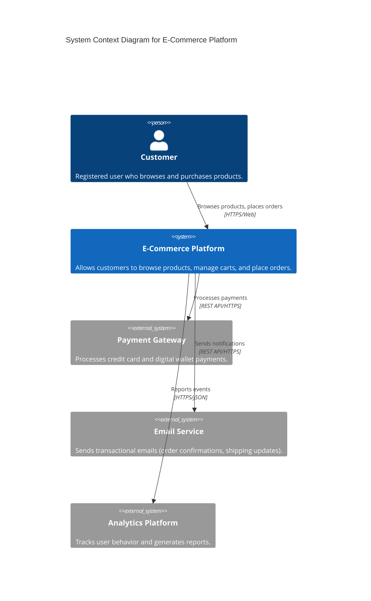
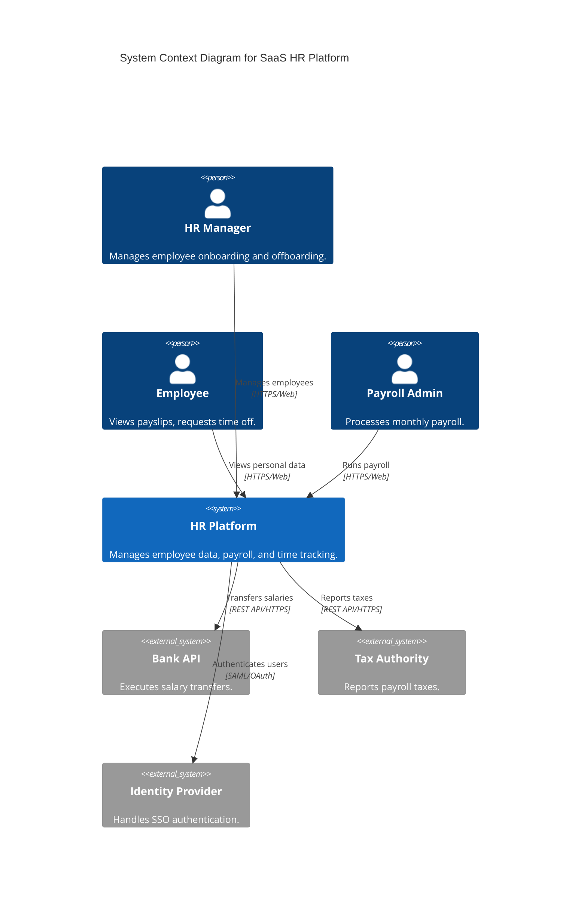
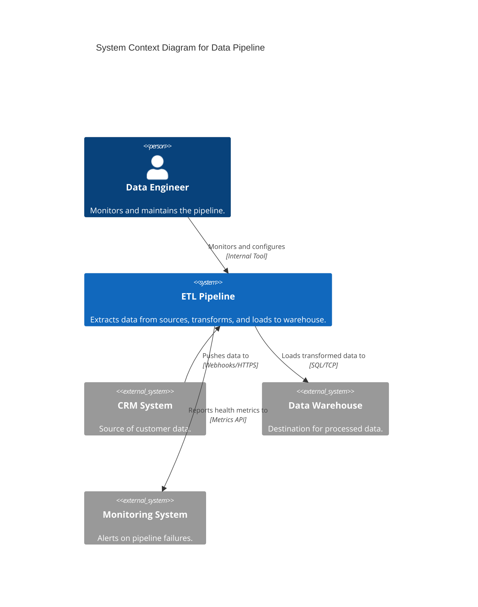

# C4 Level 1: System Context & User Journeys

Level 1 focuses on the **Big Picture**. It bridges the gap between Business Value and Technology by mapping User Journeys to System Scope.

> "A System Context diagram can be a useful starting point for diagramming and documenting a software system, allowing you to step back and see the big picture." — Simon Brown

---

## 🎯 Stakeholder Focus

| Stakeholder | What they need from L1 | Questions they ask |
|-------------|------------------------|-------------------|
| **Executives** | Value delivery, cost, risk | "What does this system do? Who uses it?" |
| **Product Managers** | Feature scope, external dependencies | "What third-party systems do we depend on?" |
| **Developers** | High-level context, data flow | "Where does user data come from? Where does it go?" |
| **Security Auditors** | Trust boundaries, data exposure | "What sensitive data leaves our system?" |

---

## 🚶 User Journey Integration

Instead of a static diagram, frame Level 1 around a **Primary User Journey**:

### The Journey Mapping Method

```
Step 1: Identify the Primary Actor
        ↓
Step 2: Define their Goal (the "Job-to-be-Done")
        ↓
Step 3: Trace the Happy Path across systems
        ↓
Step 4: Label interactions with Action Verbs
        ↓
Step 5: Identify external systems touched
```

### Example: E-Commerce "Buy Product" Journey

```
[Customer] ──"Searches for"──▶ [Product Catalog System]
     │
     ├──"Adds to cart"──▶ [Shopping Cart System]
     │
     ├──"Checks out via"──▶ [Order System]
     │         │
     │         ├──"Requests payment from"──▶ [Payment Gateway]
     │         │
     │         └──"Notifies"──▶ [Notification Service]
     │                   │
     │                   └──"Sends email via"──▶ [Email Provider]
     │
     └──"Tracks order via"──▶ [Logistics System]
```

**Action Verb Rule:** Every arrow must answer "What does the actor DO?" not "What is the connection?"

| ❌ Bad | ✅ Good |
|--------|---------|
| "Uses" | "Browses products via" |
| "Connects to" | "Submits payment to" |
| "Sends data" | "Publishes order event to" |

---

## 🏗️ L1 Diagram Structure

```
┌─────────────────────────────────────────────────────────────┐
│                    SYSTEM CONTEXT                            │
│                                                              │
│   [Person: Actor]                                            │
│        │                                                     │
│        │ "Action verb describing interaction"                │
│        ▼                                                     │
│   ┌─────────────────────────────────────┐                    │
│   │  [Software System: YOUR SYSTEM]    │                    │
│   │  "One-sentence description of       │                    │
│   │   what value it provides"           │                    │
│   └─────────────────────────────────────┘                    │
│        │                                                     │
│        │ "Action verb"                                       │
│        ▼                                                     │
│   [System_Ext: External System]                              │
│   "What it does for your system"                             │
│                                                              │
└─────────────────────────────────────────────────────────────┘
```

---

## 📝 Mermaid Templates

### Template A: Simple B2C System


### Template B: B2B Platform with Multiple Actors


### Template C: Internal System (No External Users)


---

## 🎤 Stakeholder Interview Questions

Before drawing L1, ask these questions:

### For Business Stakeholders
1. "Who are the primary users of this system?" (Persons)
2. "What is the one thing they come here to do?" (Primary journey)
3. "What other systems does ours need to talk to?" (External systems)
4. "What data enters our system? What data leaves?" (Data flow)
5. "What would happen if [external system] went down?" (Criticality)

### For Technical Stakeholders
1. "What authentication/identity system do users come from?" (Identity provider)
2. "Where do we send notifications/emails?" (Communication)
3. "What third-party APIs do we call?" (External dependencies)
4. "Is there a data warehouse or analytics platform?" (Data consumers)
5. "Are there regulatory/reporting requirements?" (Compliance systems)

---

## 🚫 Anti-Patterns to Guard (Level 1)

| Anti-Pattern | Symptom | Fix |
|-------------|---------|-----|
| **Tech Leakage** | "React", "PostgreSQL", "Kafka" appear in diagram | Remove all technology names. Use "Product Catalog" not "PostgreSQL" |
| **Container Confusion** | "Web App", "API", "Database" boxes appear | Those are L2. L1 only has the system boundary |
| **Diagram Bloat** | >15 elements | Split into multiple views: "Customer Journey", "Admin Journey" |
| **Passive Arrows** | Labels like "uses", "connects to" | Use active verbs: "places order via", "receives invoice from" |
| **Missing Descriptions** | Boxes with only names | Every element needs a one-sentence description |
| **Orphan Systems** | External systems with no relationship | Either connect them or remove them |

---

## ✅ Level 1 Success Criteria

- [ ] Is it clear who the primary user is?
- [ ] Does it answer "What value does this system provide?"
- [ ] Are all external systems (third-party) identified?
- [ ] Are relationships labeled with action verbs?
- [ ] Does a non-technical person understand the whole diagram in 30 seconds?
- [ ] **STRICT:** Is it free from all technical/implementation details?
- [ ] **STRICT:** Does it have ≤15 elements?

---

## 🔄 From L1 to L2

When you're ready to zoom in, use these signals:

| L1 Signal | L2 Action |
|-----------|-----------|
| "Our system does X, Y, and Z" | Split into 3 containers (one per capability) |
| "We have a web app and mobile app" | Two containers: Web App + Mobile App |
| "Data is stored in..." | Database container |
| "Background jobs process..." | Worker/Job processor container |
| "We use [external service] for..." | Keep as System_Ext in L2, add protocol |

**Next:** Use `c4-level2-container` to decompose your system into deployable units.

---

## 📚 References

- [C4 Model — System Context](https://c4model.com/#SystemContextDiagram) — Simon Brown
- [Structurizr DSL — System Context View](https://docs.structurizr.com/dsl/language#systemcontext-view)
