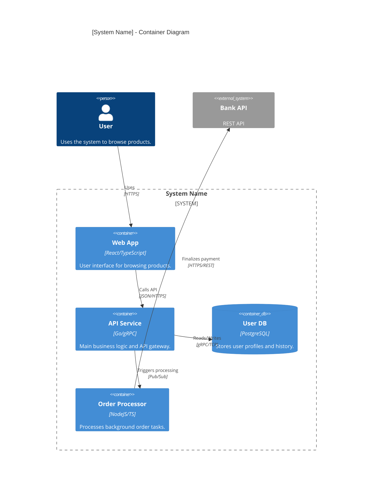

# C4 Level 2: Container Diagram & Infrastructure Mapping

The Container diagram represents the high-level **technical architecture** (web apps, mobile apps, databases, background jobs).

## 🎯 Stakeholder Focus
- **Architects:** High-level tech decisions and API boundaries.
- **Developers:** High-level system structure and cross-app communication.
- **Ops/DevOps:** Deployment strategy and infrastructure mapping.

## 🛠 Infrastructure Mapping
Level 2 should ideally map to actual infrastructure components:
- **Web App/Mobile App:** Maps to a build artifact or deployment.
- **API/Service:** Maps to a Docker container or K8s deployment.
- **Database:** Maps to a managed cloud DB or persistent container.
- **Message Broker:** Maps to Kafka, RabbitMQ, or Pub/Sub.

## 🚫 Anti-Patterns to Guard (Level 2)
- **NOT A FLOWCHART:** Avoid modeling complex business logic; use a sequence diagram for that.
- **NO LIBRARIES:** Shared libraries (DLL, JAR, NuGet) are NOT containers.
- **READABILITY:** If the system has >10 containers, consider multiple Level 2 views (e.g., "Customer View", "Admin View").

## 🔍 Codebase Scanning (L2 Synthesis)
To identify containers in an existing codebase, scan for:
- **Build manifests:** `package.json`, `pom.xml`, `go.mod`, `requirements.txt`.
- **Docker files:** `Dockerfile`, `docker-compose.yml`.
- **Infrastructure:** `Terraform` files, `k8s/` manifests.

## Mermaid Template (Enhanced C4Container)

## Level 2 Success Criteria
- [ ] Are all containers separately deployable units?
- [ ] Are all cross-container protocols (JSON, SQL, gRPC) specified?
- [ ] Is the diagram readable and clearly bounded?
- [ ] **SMART:** Do the containers match build/deployment artifacts in the code?
