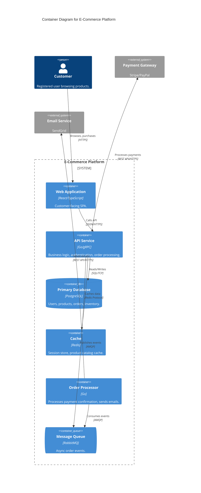
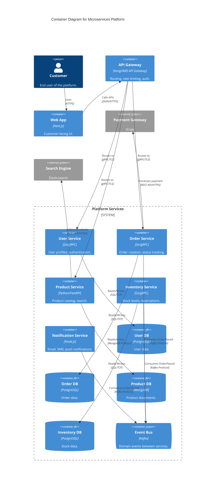
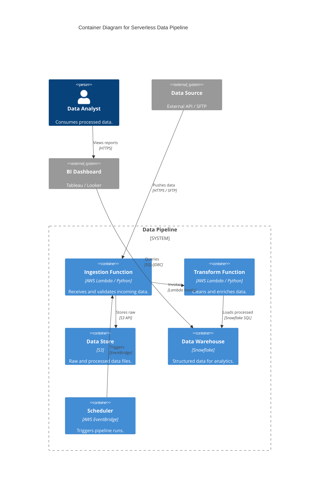

# C4 Level 2: Container Diagram & Infrastructure Mapping

The Container diagram represents the high-level **technical architecture** — web apps, mobile apps, databases, background jobs, message brokers. In C4, "Container" means a separately deployable/runnable unit, NOT Docker (though Docker containers often map 1:1).

> "A container is something that needs to be running in order for the overall software system to work." — Simon Brown

---

## 🎯 Stakeholder Focus

| Stakeholder | What they need from L2 | Questions they ask |
|-------------|------------------------|-------------------|
| **Architects** | Tech decisions, API boundaries | "Why Go for API and React for frontend?" |
| **Developers** | System structure, cross-app communication | "How do services talk to each other?" |
| **Ops/DevOps** | Deployment strategy, infrastructure | "How many containers? What needs monitoring?" |
| **Security** | Trust boundaries, data flow | "What protocols encrypt data in transit?" |

---

## 🏗️ Container Types & Mapping

| Container Type | Description | Maps To | Example Tech |
|---------------|-------------|---------|-------------|
| **Web Application** | Browser-based UI | Build artifact (SPA bundle) | React, Vue, Angular |
| **Mobile App** | Native or cross-platform mobile | App store binary | iOS (Swift), Android (Kotlin), Flutter |
| **API Application** | HTTP/gRPC API server | Docker container, K8s deployment | Go, Python/FastAPI, Node.js/Express, Java/Spring |
| **Database** | Persistent data store | Managed DB, persistent volume | PostgreSQL, MySQL, MongoDB, Redis |
| **Message Broker** | Async messaging | K8s StatefulSet, managed service | Kafka, RabbitMQ, AWS SQS, NATS |
| **File Store** | Object/blob storage | Cloud bucket, NFS | S3, GCS, Azure Blob |
| **Background Worker** | Async job processor | K8s CronJob, queue consumer | Celery, Sidekiq, Go worker |
| **Cache** | In-memory data | Redis/Memcached instance | Redis, Memcached |

### Infrastructure Mapping Rules

```
L2 Container          →   Infrastructure Artifact
─────────────────────────────────────────────────────
Web App               →   Docker image + Nginx/CDN
API Service           →   Docker container + K8s Deployment
Database              →   Cloud SQL / RDS / Persistent Volume
Message Broker        →   K8s StatefulSet / Managed Service
Background Worker     →   K8s CronJob / Queue Consumer
Cache                 →   Redis Cluster / ElastiCache
```

---

## 🚫 Anti-Patterns to Guard (Level 2)

| Anti-Pattern | Symptom | Fix |
|-------------|---------|-----|
| **Flowchart Confusion** | Business logic steps in diagram | Use sequence diagram for flows. L2 shows structure, not process |
| **Library as Container** | "Shared Utils", "Common Library" as boxes | Libraries are code (L3/L4), not deployable units |
| **Diagram Overload** | >10 containers in one view | Split: "Customer View", "Admin View", "Data Pipeline View" |
| **Missing Protocols** | Arrows without labels | Every arrow needs protocol: "JSON/HTTPS", "gRPC/TCP", "SQL/TCP" |
| **Shared Database** | Multiple containers → one DB without ownership | Each container should own its data. Shared DB = tight coupling |
| **Missing Boundaries** | Containers floating without system boundary | Wrap in `System_Boundary` to show scope |

---

## 🔍 Codebase Scanning (L2 Synthesis)

To identify containers in an existing codebase, scan for:

### Build Manifests (Tech Stack)
```bash
# JavaScript/TypeScript
package.json → frontend framework, backend runtime

# Go
go.mod → modules, HTTP framework (gin, echo, chi)

# Java
pom.xml / build.gradle → Spring Boot, dependencies

# Python
requirements.txt / pyproject.toml → FastAPI, Django, Flask
```

### Deployment Artifacts
```bash
Dockerfile          → Container definition
docker-compose.yml  → Multi-container setup
k8s/                → Kubernetes manifests
terraform/          → Infrastructure as Code
serverless.yml      → Serverless functions (Lambda, etc.)
```

### Service Boundaries
```bash
# Look for separate entry points
src/main.go         → API service
cmd/worker/main.go  → Background worker
web/                → Frontend application
```

---

## 📝 Mermaid Templates

### Template A: Monolith with Frontend


### Template B: Microservices Architecture


### Template C: Serverless / Event-Driven


---

## 🏗️ Deployment Patterns

### Pattern 1: Single Monolith
```
┌─────────────────────────────┐
│  Load Balancer              │
└─────────────┬───────────────┘
              │
    ┌─────────┴─────────┐
    │  Monolithic App   │
    │  (Web + API +     │
    │   Background)     │
    └─────────┬─────────┘
              │
    ┌─────────┴─────────┐
    │  Database         │
    └───────────────────┘
```
**When to use:** Small team (<5), simple domain, rapid prototyping.

### Pattern 2: Frontend + Backend Split
```
┌─────────────┐     ┌─────────────┐
│  CDN/Web    │────▶│  API        │
│  (React)    │     │  (Go/Java)  │
└─────────────┘     └──────┬──────┘
                           │
              ┌────────────┼────────────┐
              ▼            ▼            ▼
         ┌────────┐  ┌────────┐  ┌────────┐
         │  DB    │  │ Cache  │  │ Queue  │
         └────────┘  └────────┘  └────────┘
```
**When to use:** Separate frontend/backend teams, different deployment cadences.

### Pattern 3: Microservices with API Gateway
```
                    ┌─────────────┐
                    │  API Gateway │
                    │  (Kong/AWS)  │
                    └──────┬──────┘
                           │
        ┌──────────────────┼──────────────────┐
        ▼                  ▼                  ▼
   ┌─────────┐      ┌─────────┐      ┌─────────┐
   │ Service │      │ Service │      │ Service │
   │   A     │      │   B     │      │   C     │
   └────┬────┘      └────┬────┘      └────┬────┘
        │                │                │
        ▼                ▼                ▼
   ┌─────────┐      ┌─────────┐      ┌─────────┐
   │  DB A   │      │  DB B   │      │  DB C   │
   └─────────┘      └─────────┘      └─────────┘
```
**When to use:** Multiple teams, independent deployability, complex domain.

---

## ✅ Level 2 Success Criteria

- [ ] Are all containers separately deployable/runnable units?
- [ ] Are all cross-container protocols (JSON, SQL, gRPC) specified?
- [ ] Is the diagram readable (≤10 containers per view)?
- [ ] **SMART:** Do containers match build/deployment artifacts in the code?
- [ ] **SMART:** Does each container own its data (no shared DB)?
- [ ] Are external systems clearly marked?
- [ ] Is there a system boundary around owned containers?

---

## 🔄 From L2 to L3

When you're ready to zoom into a container:

| L2 Signal | L3 Action |
|-----------|-----------|
| "This container has 5+ responsibilities" | Split into components |
| "Developers don't understand internal structure" | Draw component diagram |
| "We have circular imports" | L3 reveals dependency cycles |
| "This is our Core Domain" | Deep dive with `ddd-tactical` |

**Next:** Use `c4-level3-component` to design internal architecture.

---

## 📚 References

- [C4 Model — Container Diagram](https://c4model.com/#ContainerDiagram) — Simon Brown
- [Structurizr DSL — Container View](https://docs.structurizr.com/dsl/language#container-view)
- [Building Microservices](https://samnewman.io/books/building_microservices/) — Sam Newman
