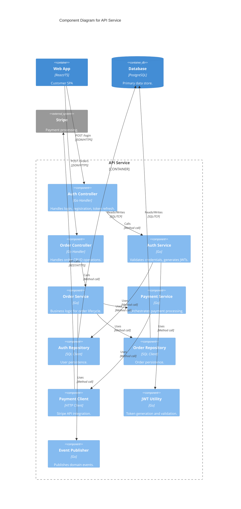
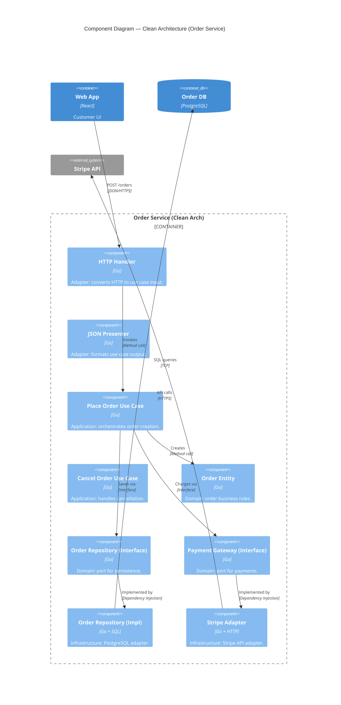

# C4 Level 3: Component Diagram & Folder Mapping

Level 3 focuses on the **internal architecture** of a single container, bridging the gap between high-level containers and low-level code. This is where architecture patterns (Clean, Hexagonal, Onion, Vertical Slice) become visible.

> "A component is a grouping of related functionality behind a well-defined interface." — Simon Brown

---

## 🎯 Stakeholder Focus

| Stakeholder | What they need from L3 | Questions they ask |
|-------------|------------------------|-------------------|
| **Developers** | Module boundaries, where to add new code | "Where does the payment logic go?" |
| **Tech Leads** | Layering, Separation of Concerns | "Is our dependency direction correct?" |
| **Architects** | Design consistency, pattern adherence | "Are we following Clean Architecture?" |
| **New Hires** | Onboarding, codebase navigation | "How is this container organized?" |

---

## 🏗️ Architecture Patterns & Component Mapping

### Pattern 1: Layered Architecture (Traditional)

```
┌─────────────────────────────────────────┐
│  Presentation Layer                     │
│  ├─ Controller/Handler                  │
│  └─ DTO/ViewModel                       │
├─────────────────────────────────────────┤
│  Business Logic Layer                   │
│  ├─ Service                             │
│  └─ Domain Model (Entity, VO)           │
├─────────────────────────────────────────┤
│  Data Access Layer                      │
│  ├─ Repository                          │
│  └─ ORM/Data Mapper                     │
└─────────────────────────────────────────┘
```

**Folder Mapping:**
```
src/
├── api/              → Presentation (controllers, handlers)
├── services/         → Business Logic (application services)
├── domain/           → Domain Model (entities, value objects)
├── repositories/     → Data Access (repository interfaces + implementations)
└── dto/              → Data Transfer Objects
```

### Pattern 2: Clean Architecture (Robert C. Martin)

```
         ┌─────────────┐
         │  Frameworks │  ← Outer: UI, DB, External APIs
         │  & Drivers  │
         └──────┬──────┘
                │ depends on
         ┌──────┴──────┐
         │  Interface  │  ← Adapters: Controllers, Presenters, Gateways
         │   Adapters  │
         └──────┬──────┘
                │ depends on
         ┌──────┴──────┐
         │  Use Cases  │  ← Application Business Rules
         │  (Services) │
         └──────┬──────┘
                │ depends on
         ┌──────┴──────┐
         │   Entities  │  ← Enterprise Business Rules (innermost)
         └─────────────┘
```

**Dependency Rule:** Dependencies point INWARD only. Inner circles know nothing about outer circles.

**Folder Mapping (Go example):**
```
internal/
├── domain/           → Entities (pure business logic, no dependencies)
│   ├── order.go
│   └── value_objects.go
├── usecase/          → Use Cases (application services)
│   ├── place_order.go
│   └── cancel_order.go
├── interface/        → Adapters (driven + driving)
│   ├── controller/   → HTTP handlers
│   ├── presenter/    → Response formatters
│   └── gateway/      → External API clients
└── infrastructure/   → Frameworks (DB, cache, message queue)
    ├── repository/   → DB implementations
    └── messaging/    → Event publishers
```

### Pattern 3: Hexagonal Architecture (Ports & Adapters)

```
              ┌──────────────┐
    ┌─────────│   Driving    │─────────┐
    │         │   Adapters   │         │
    │  HTTP   │  (Primary)   │  CLI    │
    │ Handler │              │ Tool    │
    └────┬────┴──────────────┴────┬────┘
         │                        │
         │    ┌──────────────┐    │
         └───▶│   Application │◀───┘
              │   Core (Domain)│
              │               │
         ┌───▶│   Ports       │◀───┐
         │    └──────────────┘    │
    ┌────┴────┬──────────────┬────┴────┐
    │  DB     │   External   │ Message │
    │ Adapter │   API Client │ Queue   │
    │(Driven) │   (Driven)   │Adapter  │
    └─────────┴──────────────┴─────────┘
         Driven Adapters (Secondary)
```

**Key Concepts:**
- **Port:** Interface defining what the application needs (driven) or provides (driving)
- **Adapter:** Implementation of a port for a specific technology
- **Domain:** Pure business logic, zero external dependencies

**Folder Mapping:**
```
src/
├── application/          → Use cases, domain services
│   ├── port/
│   │   ├── in/          → Driving ports (interfaces app exposes)
│   │   └── out/         → Driven ports (interfaces app needs)
│   └── service/
├── domain/              → Entities, value objects, domain events
└── adapter/
    ├── in/              → Driving adapters (HTTP, CLI, messaging)
    │   ├── web/
    │   └── cli/
    └── out/             → Driven adapters (DB, external APIs)
        ├── persistence/
        └── external/
```

### Pattern 4: Vertical Slice Architecture

```
src/
├── features/
│   ├── place_order/          → One folder per feature
│   │   ├── handler.go        → HTTP handler
│   │   ├── command.go        → CQRS command
│   │   ├── validator.go      → Input validation
│   │   ├── service.go        → Business logic
│   │   ├── repository.go     → Data access
│   │   └── dto.go            → Request/response types
│   │
│   ├── cancel_order/
│   │   ├── handler.go
│   │   ├── command.go
│   │   └── ...
│   │
│   └── list_orders/
│       ├── handler.go
│       ├── query.go          → CQRS query
│       └── ...
│
└── shared/                   → Cross-cutting concerns
    ├── middleware/
    ├── auth/
    └── logging/
```

**Principle:** Each feature is self-contained. No horizontal layers. Changes to "Place Order" only touch `features/place_order/`.

---

## 📝 Mermaid Templates

### Template A: Layered Architecture (API Service)


### Template B: Clean Architecture (Go)


---

## 🛠 Folder Structure Mapping by Language

### Go (Clean Architecture)
```
internal/
├── domain/
│   ├── entity/
│   │   └── order.go
│   ├── valueobject/
│   │   └── money.go
│   └── event/
│       └── order_placed.go
├── usecase/
│   ├── place_order.go
│   └── cancel_order.go
├── adapter/
│   ├── in/
│   │   └── http/
│   │       └── order_handler.go
│   └── out/
│       ├── persistence/
│       │   └── order_repository.go
│       └── payment/
│           └── stripe_adapter.go
└── config/
    └── app.go
```

### Python (Hexagonal / FastAPI)
```
src/
├── domain/
│   ├── models/
│   │   └── order.py
│   ├── value_objects/
│   │   └── money.py
│   └── events/
│       └── order_placed.py
├── application/
│   ├── ports/
│   │   ├── in/
│   │   │   └── order_use_case.py
│   │   └── out/
│   │       ├── order_repository.py
│   │       └── payment_gateway.py
│   └── services/
│       └── order_service.py
├── adapters/
│   ├── in/
│   │   └── web/
│   │       └── order_router.py
│   └── out/
│       ├── persistence/
│       │   └── sqlalchemy_order_repo.py
│       └── payment/
│           └── stripe_client.py
└── main.py
```

### TypeScript (Vertical Slice / NestJS-style)
```
src/
├── features/
│   ├── orders/
│   │   ├── orders.module.ts
│   │   ├── place-order/
│   │   │   ├── place-order.handler.ts
│   │   │   ├── place-order.command.ts
│   │   │   └── place-order.dto.ts
│   │   ├── cancel-order/
│   │   │   └── ...
│   │   └── list-orders/
│   │       └── ...
│   └── payments/
│       └── ...
├── shared/
│   ├── decorators/
│   ├── filters/
│   └── guards/
└── main.ts
```

---

## 🚫 Anti-Patterns to Guard (Level 3)

| Anti-Pattern | Symptom | Fix |
|-------------|---------|-----|
| **Over-Detailing** | Every class drawn | Only major logical groupings (5-15 components) |
| **Mixing Containers** | Components from multiple containers | Focus on ONE container per diagram |
| **Circular Dependencies** | A→B→C→A cycle | Refactor: extract shared interface, merge, or restructure |
| **Anemic Components** | Component with no clear responsibility | Rename to reflect single responsibility |
| **Layer Violation** | Domain imports infrastructure | In Clean/Hexagonal: domain must have zero external deps |
| **God Component** | One component handles everything | Split by responsibility or feature |

---

## 🔍 Codebase Scanning (L3 Synthesis)

```bash
# Identify component boundaries by folder structure
find src -type d -maxdepth 2 | sort

# Look for architecture patterns
grep -r "interface\|abstract class\|port\|adapter" src/ --include="*.go" --include="*.ts" --include="*.py"

# Check dependency direction (domain should not import infrastructure)
# In Go: check go.mod or import paths
grep -r "infrastructure\|adapter\|external" internal/domain/ || echo "✅ Clean: domain has no infra imports"

# Find circular dependencies
# Go: use golang.org/x/tools/cmd/depgraph or go mod graph
# Python: use pipdeptree or import-linter
# TypeScript: use madge
```

---

## ✅ Level 3 Success Criteria

- [ ] Does the diagram map directly to the container's folder structure?
- [ ] Are internal interactions (method calls/internal events) clearly labeled?
- [ ] Is it clear how each component contributes to the container's responsibility?
- [ ] **STRICT:** Does it focus only on the zoomed-in container?
- [ ] **STRICT:** Are there ≤15 components?
- [ ] Does the dependency direction follow the chosen architecture pattern?
- [ ] Are circular dependencies identified and resolved?

---

## 🔄 From L3 to L4

| L3 Signal | L4 Action |
|-----------|-----------|
| "This component has complex internal logic" | UML class diagram |
| "The data model is hard to understand" | ERD (Entity Relationship Diagram) |
| "New developers struggle with this module" | Document key classes and their relationships |
| "We need to refactor this component" | L4 reveals exact coupling points |

**Next:** Use `c4-level4-code` for implementation details.

---

## 📚 References

- [C4 Model — Component Diagram](https://c4model.com/#ComponentDiagram) — Simon Brown
- [Clean Architecture](https://blog.cleancoder.com/uncle-bob/2012/08/13/the-clean-architecture.html) — Robert C. Martin
- [Hexagonal Architecture](https://alistair.cockburn.us/hexagonal-architecture/) — Alistair Cockburn
- [Vertical Slice Architecture](https://jimmybogard.com/vertical-slice-architecture/) — Jimmy Bogard
