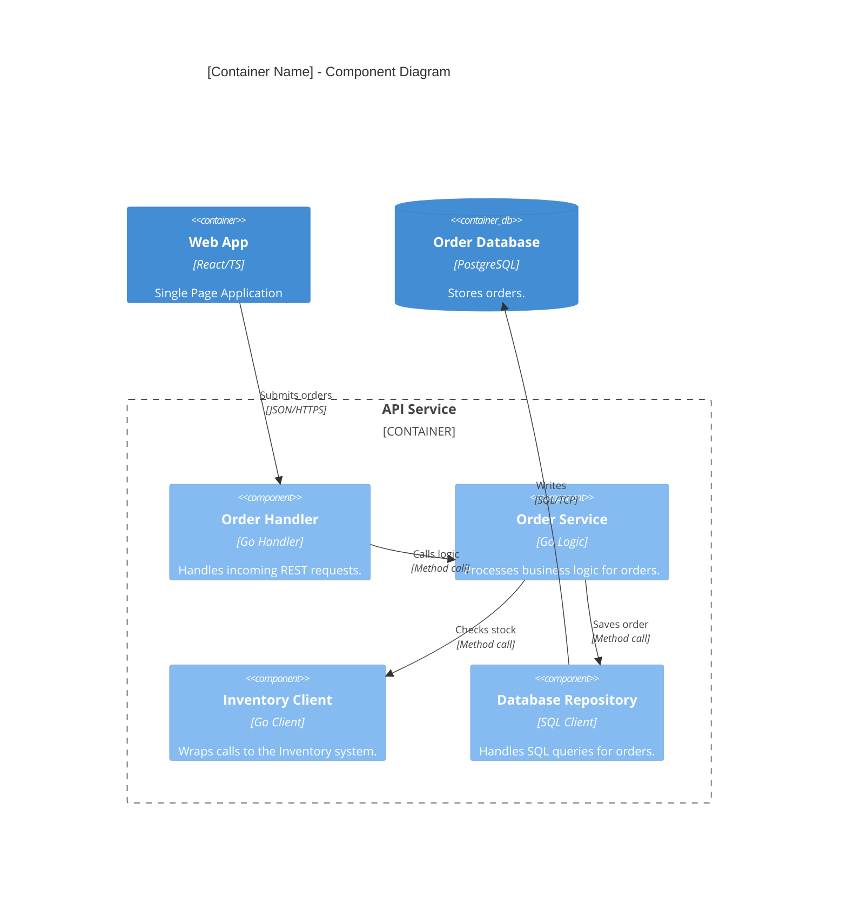

# C4 Level 3: Component Diagram & Folder Mapping

Level 3 focuses on the **internal architecture** of a single container, bridging the gap between high-level containers and low-level code.

## 🎯 Stakeholder Focus
- **Developers:** Understanding internal module boundaries and dependencies.
- **Architects:** Ensuring proper layering and Separation of Concerns.

## 🛠 Folder Structure Mapping
Level 3 should ideally map to your folder structure:
- **Controller/Handler:** Maps to `src/api`, `internal/handler`.
- **Service/Logic:** Maps to `src/services`, `internal/usecase`.
- **Repository/Data Access:** Maps to `src/db`, `internal/repository`.
- **Infrastructure Wrapper:** Maps to `pkg/email`, `src/adapters`.

## 🚫 Anti-Patterns to Guard (Level 3)
- **OVER-DETAILING:** Don't draw every class. Only draw major logical groupings.
- **MIXING CONTAINERS:** Focus only on ONE container at a time.
- **CIRCULAR DEPENDENCIES:** Level 3 is the best place to identify and fix tight coupling.

## 🔍 Codebase Scanning (L3 Synthesis)
To identify components in a container, scan for:
- **Folder Names:** `services/`, `controllers/`, `handlers/`, `repositories/`, `models/`.
- **Project Structure Patterns:** Layered architecture, Clean Architecture (Hexagonal), or Feature-based folders.

## Mermaid Template (Enhanced C4Component)

## Level 3 Success Criteria
- [ ] Does the diagram map directly to the container's folder structure?
- [ ] Are internal interactions (method calls/internal events) clearly labeled?
- [ ] Is it clear how each component contributes to the container's responsibility?
- [ ] **STRICT:** Does it focus only on the zoomed-in container?
