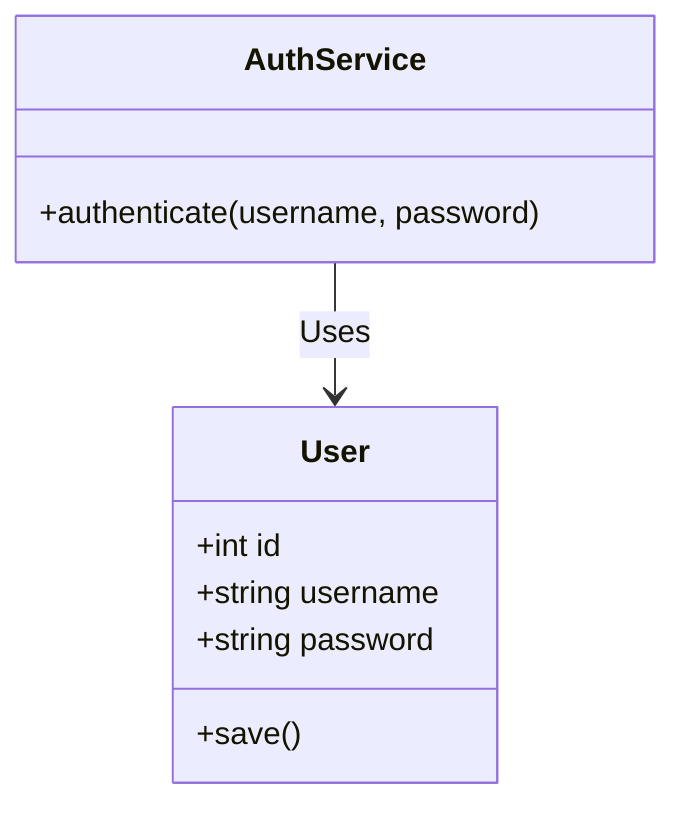
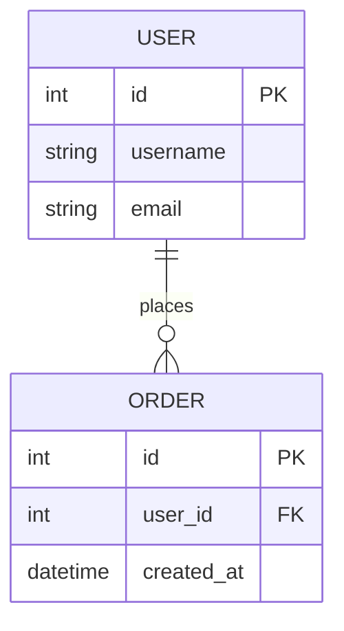

# C4 Level 4: Code Diagram

The Code diagram is the lowest level of detail, showing how a single component is implemented. It's often used for complex components or database schemas.

## Core Principles (MANDATORY)

- **Optionality:** Level 4 is usually optional. Only use it when the internal implementation is too complex to understand without a visual map.
- **Specific Implementation:** Use standard UML class diagram notation or ER diagrams (Entity Relationship Diagrams) for data models.
- **Keep it Focused:** Don't diagram the entire codebase. Focus on the core classes or tables that provide the component's value.

## Elements Used

1.  **Class:** Classes, interfaces, types.
2.  **Table:** Database tables, columns, relationships (Primary/Foreign keys).
3.  **Relationship:** Inheritance, composition, aggregation, or data associations.

## Mermaid Templates

### UML Class Diagram Template

### ER Diagram (Database) Template

## Level 4 Review Checklist

- [ ] Is this diagram necessary for understanding the component?
- [ ] Are relationships (inheritance, association) correctly labeled?
- [ ] Is the diagram focused on only the most important parts?
- [ ] Does it correctly reflect the actual codebase structure?
