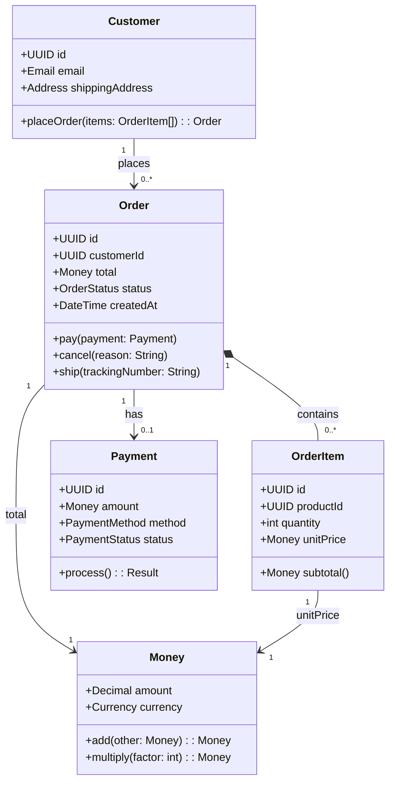
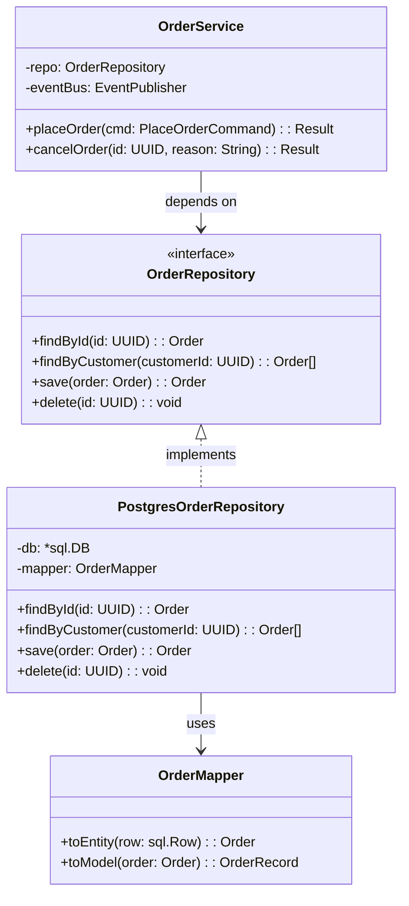
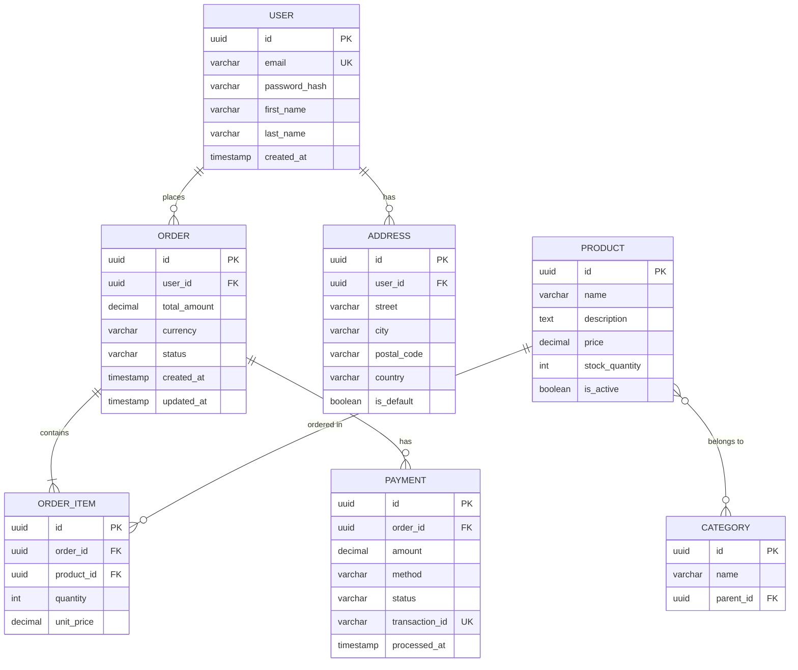

# C4 Level 4: Code Diagram

The Code diagram is the lowest level of detail, showing how a single component is implemented. It's **usually optional** — only use it when the internal implementation is too complex to understand without a visual map.

> "The code level is typically only used to describe complex parts of the codebase, or when you want to generate diagrams from the code." — Simon Brown

---

## 🎯 When to Use Level 4

| Situation | Diagram Type | Why |
|-----------|-------------|-----|
| Complex domain model with many entities | UML Class Diagram | Show inheritance, composition, associations |
| Database schema with 10+ tables | ER Diagram | Show relationships, keys, constraints |
| State machine logic | State Diagram | Show states and transitions |
| Complex algorithm | Activity/Sequence Diagram | Show flow and decision points |
| API contract design | OpenAPI/Interface Diagram | Show endpoints, request/response types |

**When NOT to use:** Simple CRUD, standard patterns, or when the code is self-explanatory.

---

## 🛠 UML Class Diagram

### Notation Reference

```
┌─────────────────────┐
│     ClassName       │  ← Class/Interface name
├─────────────────────┤
│ + publicField: Type │  ← Attributes (+ public, - private, # protected)
│ - _privateField: int│
├─────────────────────┤
│ + method(): Return  │  ← Methods
│ - _helper(): void   │
└─────────────────────┘

Relationships:
  ───────▶   Association (A uses B)
  ──────◆   Composition (A owns B, B cannot exist without A)
  ──────◇   Aggregation (A has B, B can exist independently)
  ────▷   Inheritance (A extends B)
  - - -▷   Implementation (A implements B)
  ─────▶  Dependency (A depends on B)
```

### Mermaid Template: Domain Model


### Mermaid Template: Repository Pattern


---

## 🗄 ER Diagram (Entity Relationship)

### Notation Reference

```
Cardinality:
  ||--o{   One-to-Many (1:N)
  ||--||   One-to-One (1:1)
  }o--o{   Many-to-Many (N:M)

Keys:
  PK = Primary Key
  FK = Foreign Key
  UK = Unique Key
```

### Mermaid Template: E-Commerce Database


---

## 💻 Language-Specific Templates

### Go: Structs and Interfaces
```go
// Value Object — immutable, validated at creation
type Money struct {
    Amount   decimal.Decimal
    Currency string // ISO 4217: USD, EUR, VND
}

func NewMoney(amount decimal.Decimal, currency string) (Money, error) {
    if !isValidCurrency(currency) {
        return Money{}, fmt.Errorf("invalid currency: %s", currency)
    }
    if amount.IsNegative() {
        return Money{}, fmt.Errorf("amount cannot be negative")
    }
    return Money{Amount: amount, Currency: currency}, nil
}

func (m Money) Add(other Money) (Money, error) {
    if m.Currency != other.Currency {
        return Money{}, fmt.Errorf("cannot add different currencies")
    }
    return NewMoney(m.Amount.Add(other.Amount), m.Currency)
}

// Entity — has identity, mutable state with business rules
type Order struct {
    ID        uuid.UUID
    CustomerID uuid.UUID
    Items     []OrderItem
    Total     Money
    Status    OrderStatus
    CreatedAt time.Time
    events    []DomainEvent // unexported: internal only
}

func (o *Order) Pay(payment Payment) error {
    if o.Status != OrderStatusPending {
        return fmt.Errorf("cannot pay order with status %s", o.Status)
    }
    if !payment.Amount.Equals(o.Total) {
        return fmt.Errorf("payment amount %v does not match order total %v", 
            payment.Amount, o.Total)
    }
    o.Status = OrderStatusPaid
    o.events = append(o.events, OrderPaidEvent{OrderID: o.ID})
    return nil
}

func (o *Order) PullEvents() []DomainEvent {
    events := o.events
    o.events = nil
    return events
}

// Repository Interface (Port in Hexagonal)
type OrderRepository interface {
    FindByID(ctx context.Context, id uuid.UUID) (*Order, error)
    FindByCustomer(ctx context.Context, customerID uuid.UUID) ([]*Order, error)
    Save(ctx context.Context, order *Order) error
    Delete(ctx context.Context, id uuid.UUID) error
}
```

### Python: Dataclasses and Protocols
```python
from dataclasses import dataclass, field
from decimal import Decimal
from typing import Protocol, List
from uuid import UUID, uuid4
from datetime import datetime

# Value Object — frozen dataclass
@dataclass(frozen=True)
class Money:
    amount: Decimal
    currency: str  # ISO 4217

    def __post_init__(self):
        if self.amount < 0:
            raise ValueError("Amount cannot be negative")
        if self.currency not in VALID_CURRENCIES:
            raise ValueError(f"Invalid currency: {self.currency}")

    def add(self, other: "Money") -> "Money":
        if self.currency != other.currency:
            raise ValueError("Cannot add different currencies")
        return Money(self.amount + other.amount, self.currency)

    def multiply(self, factor: int) -> "Money":
        return Money(self.amount * factor, self.currency)

# Entity
@dataclass
class Order:
    id: UUID = field(default_factory=uuid4)
    customer_id: UUID = field(default_factory=uuid4)
    items: List["OrderItem"] = field(default_factory=list)
    total: Money = field(default_factory=lambda: Money(Decimal("0"), "USD"))
    status: "OrderStatus" = field(default="PENDING")
    created_at: datetime = field(default_factory=datetime.utcnow)
    _events: List["DomainEvent"] = field(default_factory=list, repr=False)

    def pay(self, payment: "Payment") -> None:
        if self.status != "PENDING":
            raise ValueError(f"Cannot pay order with status {self.status}")
        if payment.amount != self.total:
            raise ValueError("Payment amount does not match order total")
        self.status = "PAID"
        self._events.append(OrderPaidEvent(order_id=self.id))

    def pull_events(self) -> List["DomainEvent"]:
        events = self._events.copy()
        self._events.clear()
        return events

# Repository Protocol (Port)
class OrderRepository(Protocol):
    def find_by_id(self, order_id: UUID) -> Order: ...
    def find_by_customer(self, customer_id: UUID) -> List[Order]: ...
    def save(self, order: Order) -> Order: ...
    def delete(self, order_id: UUID) -> None: ...
```

### TypeScript: Classes and Interfaces
```typescript
// Value Object — immutable, validated
class Money {
    constructor(
        public readonly amount: Decimal,
        public readonly currency: string // ISO 4217
    ) {
        if (amount.isNegative()) {
            throw new Error('Amount cannot be negative');
        }
        if (!isValidCurrency(currency)) {
            throw new Error(`Invalid currency: ${currency}`);
        }
    }

    add(other: Money): Money {
        if (this.currency !== other.currency) {
            throw new Error('Cannot add different currencies');
        }
        return new Money(this.amount.add(other.amount), this.currency);
    }

    multiply(factor: number): Money {
        return new Money(this.amount.mul(factor), this.currency);
    }

    equals(other: Money): boolean {
        return this.amount.equals(other.amount) && this.currency === other.currency;
    }
}

// Entity
class Order {
    private _events: DomainEvent[] = [];

    constructor(
        public readonly id: UUID,
        public readonly customerId: UUID,
        public items: OrderItem[],
        public total: Money,
        public status: OrderStatus = OrderStatus.PENDING,
        public readonly createdAt: Date = new Date()
    ) {}

    pay(payment: Payment): void {
        if (this.status !== OrderStatus.PENDING) {
            throw new Error(`Cannot pay order with status ${this.status}`);
        }
        if (!payment.amount.equals(this.total)) {
            throw new Error('Payment amount does not match order total');
        }
        this.status = OrderStatus.PAID;
        this._events.push(new OrderPaidEvent(this.id));
    }

    pullEvents(): DomainEvent[] {
        const events = [...this._events];
        this._events = [];
        return events;
    }
}

// Repository Interface (Port)
interface OrderRepository {
    findById(id: UUID): Promise<Order | null>;
    findByCustomer(customerId: UUID): Promise<Order[]>;
    save(order: Order): Promise<Order>;
    delete(id: UUID): Promise<void>;
}
```

---

## 🚫 Level 4 Anti-Patterns

| Anti-Pattern | Symptom | Fix |
|-------------|---------|-----|
| **Diagram Entire Codebase** | 50+ classes in one diagram | Focus on 5-10 key classes that represent the component's value |
| **Outdated Diagrams** | Code changed, diagram didn't | Generate from code (IDE plugins) or accept L4 as temporary |
| **Wrong Abstraction Level** | Showing utility classes, DTOs | Focus on domain entities, aggregates, and key interfaces |
| **Missing Multiplicity** | Associations without cardinality | Always specify 1:1, 1:N, N:M |
| **Wrong Relationship Type** | Using inheritance for "has-a" | Composition for ownership, aggregation for reference |

---

## ✅ Level 4 Review Checklist

- [ ] Is this diagram necessary for understanding the component?
- [ ] Are relationships (inheritance, association, composition) correctly labeled?
- [ ] Is the diagram focused on only the most important parts (≤10 classes/tables)?
- [ ] Does it correctly reflect the actual codebase structure?
- [ ] Are cardinalities specified on all associations?
- [ ] Are keys (PK, FK) marked in ERDs?
- [ ] Would a new developer understand this component after reading the diagram?

---

## 📚 References

- [C4 Model — Code Diagram](https://c4model.com/#CodeDiagram) — Simon Brown
- [Mermaid Class Diagram](https://mermaid.js.org/syntax/classDiagram.html)
- [Mermaid ER Diagram](https://mermaid.js.org/syntax/entityRelationshipDiagram.html)
- [UML Class Diagram Reference](https://www.uml-diagrams.org/class-diagrams-overview.html)
