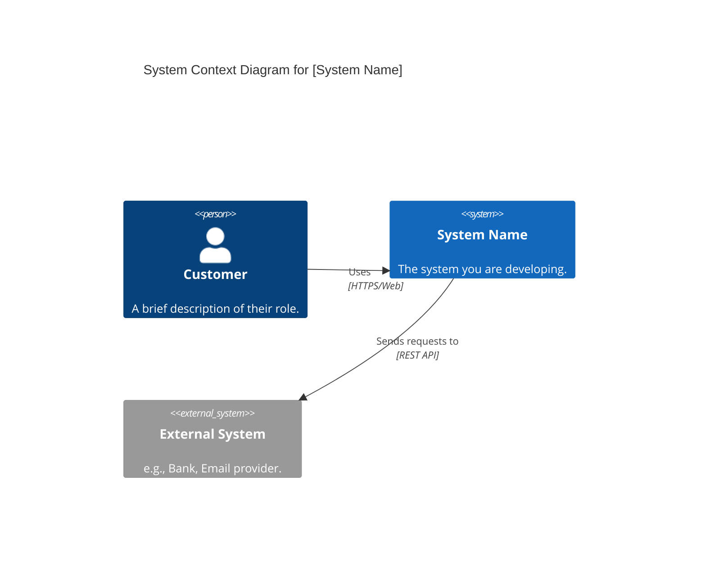
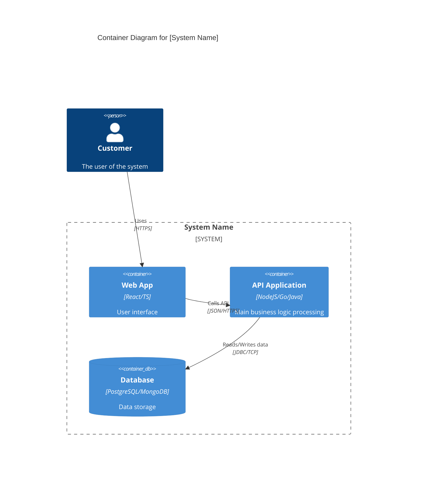
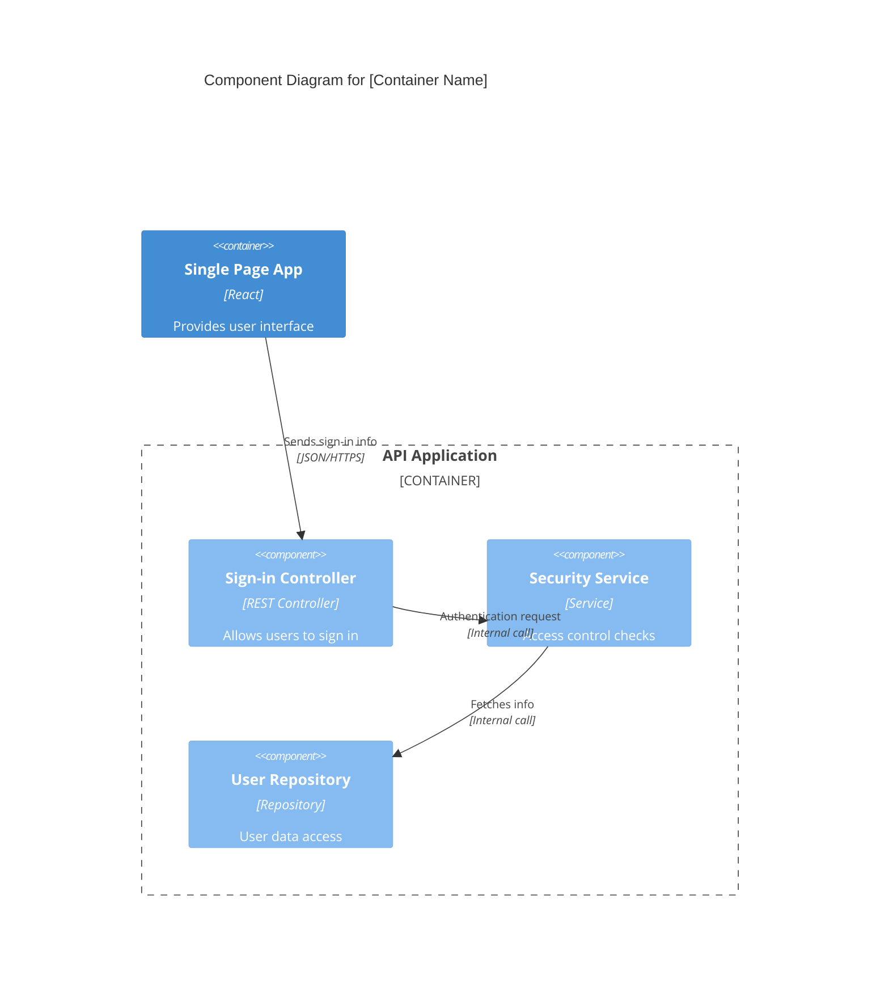

# C4 Model Templates

This file provides basic code templates for Mermaid and Structurizr DSL to quickly start drawing C4 diagrams.

## 1. Mermaid C4 Templates

### Level 1: System Context


### Level 2: Container


### Level 3: Component


## 2. Structurizr DSL Templates

```structurizr
workspace {
    model {
        customer = person "Customer" "User description"
        softwareSystem = softwareSystem "System Name" "System description" {
            webApp = container "Web App" "Provides user interface" "React"
            apiApp = container "API Application" "Provides API for Web App" "NodeJS"
            database = container "Database" "Stores user data" "PostgreSQL" "Database"
            
            webApp -> apiApp "Sends requests" "JSON/HTTPS"
            apiApp -> database "Reads/Writes data" "SQL/TCP"
        }
        
        externalSystem = softwareSystem "External System" "e.g., Bank API"

        customer -> softwareSystem "Uses"
        customer -> webApp "Accesses" "HTTPS"
        softwareSystem -> externalSystem "Sends info" "HTTPS"
    }

    views {
        systemContext softwareSystem "SystemContext" {
            include *
            autoLayout
        }
        
        container softwareSystem "Containers" {
            include *
            autoLayout
        }

        theme default
    }
}
```
