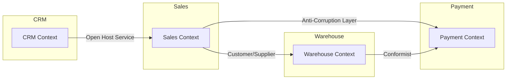
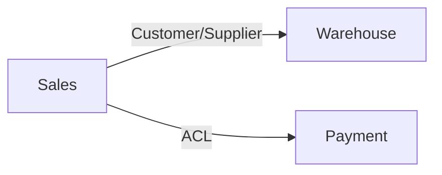

# Domain-Driven Design (DDD): Strategic Hub & Workshop

"The heart of software is its ability to solve domain-related problems for its user." — Eric Evans, *Domain-Driven Design* (2003)

Strategic DDD is about **taming complexity** by identifying what to build, how to organize teams, and where to focus investment. It answers: *What are the boundaries of our system? What is our competitive advantage? How do teams align with domains?*

---

## 🌪 Event Storming: The Discovery Workshop

Event Storming, created by Alberto Brandolini, is a collaborative workshop where domain experts and developers explore business processes together. It's the fastest way to discover Bounded Contexts.

### Before You Start

**Participants (4-8 people ideal):**
- 1-2 Domain Experts (know the business inside-out)
- 2-3 Developers (will build the system)
- 1 Facilitator (keeps time, asks "why?")
- Optional: UX designer, QA, product manager

**Materials:**
- Large wall or whiteboard (6+ meters)
- Orange sticky notes (Domain Events)
- Blue sticky notes (Commands)
- Yellow sticky notes (Actors/Users)
- Pink sticky notes (Policies/Business Rules)
- Green sticky notes (Views/Read Models)
- Purple sticky notes (Aggregates)
- Markers, timer (45-90 minutes)

### Phase 1: Big Picture (Chaotic Exploration)

**Goal:** Dump ALL domain events onto the wall. No filtering.

**Instructions:**
1. Everyone writes domain events on orange stickies — one event per sticky
2. Events must be in **past tense**: `OrderPlaced`, `PaymentReceived`, `InventoryReserved`
3. Place them on the wall in rough chronological order
4. **Rule:** No discussion longer than 2 minutes per event. Move fast.

**Example Events for E-Commerce:**
```
UserRegistered, ProductAddedToCart, CartCheckedOut,
OrderPlaced, PaymentInitiated, PaymentConfirmed,
InventoryReserved, OrderConfirmed, ShippingLabelCreated,
OrderShipped, DeliveryConfirmed, OrderCompleted,
RefundRequested, RefundProcessed
```

**Time:** 15-20 minutes

### Phase 2: Timeline & Hotspots

**Goal:** Organize events into a coherent timeline. Identify problems.

**Instructions:**
1. Arrange events left-to-right in chronological order
2. Add **hotspots** (red stickies) where:
   - People disagree on what happens
   - The process is unclear
   - There are known bugs or pain points
   - Multiple teams are involved
3. Don't solve hotspots yet — just mark them

**Time:** 10-15 minutes

### Phase 3: Actors & Commands

**Goal:** Identify WHO triggers WHAT.

**Instructions:**
1. For each event, ask: "What command caused this?"
2. Write commands on **blue** stickies, place before the event
3. Ask: "Who issues this command?"
4. Write actors on **yellow** stickies, place before the command

```
[Actor: Customer] → [Command: PlaceOrder] → [Event: OrderPlaced]
[Actor: System]   → [Command: ProcessPayment] → [Event: PaymentConfirmed]
[Actor: Warehouse]→ [Command: ShipOrder] → [Event: OrderShipped]
```

**Time:** 15-20 minutes

### Phase 4: Policies & Business Rules

**Goal:** Capture automated decisions.

**Instructions:**
1. Look for events that trigger other events automatically
2. Write policies on **pink** stickies
3. Format: "Whenever [Event], then [Command/Action]"

```
[Policy: Whenever PaymentConfirmed, then ReserveInventory]
[Policy: Whenever InventoryReserved, then ConfirmOrder]
[Policy: Whenever OrderConfirmed, then CreateShippingLabel]
```

**Time:** 10 minutes

### Phase 5: Aggregate Identification

**Goal:** Group related commands and events into consistency boundaries.

**Instructions:**
1. Draw boundaries around clusters of events that change together
2. Name each cluster — this is your **Aggregate**
3. Ask: "Can these events be inconsistent with each other?" If yes, same aggregate.

```
┌─────────────────────────────┐
│  ORDER AGGREGATE            │
│  ─────────────────          │
│  Events:                    │
│    OrderPlaced              │
│    PaymentConfirmed         │
│    OrderConfirmed           │
│    OrderShipped             │
│    OrderCompleted           │
│                             │
│  Commands:                  │
│    PlaceOrder               │
│    ConfirmPayment           │
│    ShipOrder                │
└─────────────────────────────┘

┌─────────────────────────────┐
│  INVENTORY AGGREGATE        │
│  ─────────────────          │
│  Events:                    │
│    InventoryReserved        │
│    InventoryReleased        │
│    StockReplenished         │
│                             │
│  Commands:                  │
│    ReserveInventory         │
│    ReleaseInventory         │
│    ReplenishStock           │
└─────────────────────────────┘
```

**Time:** 15-20 minutes

### Phase 6: Bounded Context Mapping

**Goal:** Group aggregates into logical boundaries with their own Ubiquitous Language.

**Instructions:**
1. Look at aggregates and ask: "Do they share the same language?"
2. Example: `Order` in Sales means "a customer's purchase". `Order` in Warehouse means "a pick list". Different meanings = different contexts.
3. Draw boundaries around aggregates that share language
4. Name each boundary — this is your **Bounded Context**

```
┌─────────────────────────────────────────────────────────────┐
│                    SALES CONTEXT                            │
│  Language: "Customer", "Order", "Cart", "Checkout"          │
│  Aggregates: Customer, Cart, Order                          │
└─────────────────────────────────────────────────────────────┘

┌─────────────────────────────────────────────────────────────┐
│                   WAREHOUSE CONTEXT                         │
│  Language: "Pick List", "Shipment", "Inventory", "Bin"      │
│  Aggregates: Inventory, Shipment, PickList                  │
└─────────────────────────────────────────────────────────────┘

┌─────────────────────────────────────────────────────────────┐
│                  PAYMENT CONTEXT                            │
│  Language: "Transaction", "Authorization", "Settlement"     │
│  Aggregates: Payment, Transaction, Refund                   │
└─────────────────────────────────────────────────────────────┘
```

**Time:** 15-20 minutes

---

## 🎯 Subdomain Types (ROI Focus)

Not all parts of your domain are equal. Prioritize investment based on business value.

| Type | Description | Strategy | Team Allocation |
|------|-------------|----------|-----------------|
| **Core Domain** | Your unique competitive advantage. Complex, high value. Differentiates you from competitors. | **Build in-house** with top talent. Invest heavily in DDD. | 60-70% of best engineers |
| **Supporting Subdomain** | Necessary but not differentiating. Medium complexity. | **Build** or use open-source. Good quality, not perfect. | 20-30% |
| **Generic Subdomain** | Standard problems with off-the-shelf solutions. Low complexity. | **Buy/SaaS**. Don't build what you can buy. | 10% |

### Example: E-Commerce Platform

| Subdomain | Type | Rationale |
|-----------|------|-----------|
| Product Recommendation Engine | **Core** | Proprietary ML algorithm drives conversion |
| Order Management | **Core** | Custom workflows, complex business rules |
| Payment Processing | **Generic** | Use Stripe/PayPal — not our expertise |
| User Authentication | **Generic** | Use Auth0/Firebase Auth |
| Email Notifications | **Supporting** | Build thin wrapper around SendGrid |
| Inventory Management | **Supporting** | Build, but keep simple |

### The Strategic Investment Rule

```
┌────────────────────────────────────────────┐
│  Invest MOST in Core Domain                │
│  ├── Hire best domain experts              │
│  ├── Apply full DDD (Strategic + Tactical) │
│  ├── Continuous refinement                 │
│  └── Protect from generic solutions        │
│                                            │
│  Invest MODERATELY in Supporting           │
│  ├── Good enough quality                   │
│  ├── Standard patterns                     │
│  └── Open-source where possible            │
│                                            │
│  Invest LEAST in Generic                   │
│  ├── Buy/SaaS                              │
│  ├── Minimize custom code                  │
│  └── Focus integration, not implementation │
└────────────────────────────────────────────┘
```

---

## 🔗 Context Mapping Patterns

Context Maps describe how Bounded Contexts interact. They're as important as the contexts themselves.

### Relationship Types

```
Upstream (Power)          Downstream (Dependent)
    │                            │
    │  ──── Published Language ─▶│
    │  ──── Open Host Service ──▶│
    │                            │
    │◀──── Anti-Corruption Layer │
    │                            │
    │◀──────── Conformist ──────│
```

### Pattern Catalog

| Pattern | Direction | When to Use | Risk |
|---------|-----------|-------------|------|
| **Partnership** | Mutual | Two teams collaborate closely, shared goals | Medium — requires trust |
| **Shared Kernel** | Mutual | Small shared model, high coordination | **High** — changes affect both |
| **Customer/Supplier** | Upstream→Downstream | Upstream prioritizes downstream needs | Low — clear contract |
| **Conformist** | Downstream→Upstream | Downstream accepts upstream model as-is | Low — but limits downstream |
| **Anti-Corruption Layer (ACL)** | Downstream | Downstream translates upstream model | Medium — translation overhead |
| **Open Host Service (OHS)** | Upstream | Upstream publishes well-defined API | Low — standard integration |
| **Published Language** | Upstream | Upstream defines shared data format | Low — with versioning |
| **Separate Ways** | None | Contexts don't need to integrate | None — but missed opportunities |
| **Big Ball of Mud** | — | Legacy system with no clear boundaries | **Very High** — contain with ACL |

### Context Map Example: E-Commerce



**Legend:**
- Sales → Warehouse: Sales is customer, Warehouse is supplier. Warehouse team prioritizes Sales needs.
- Sales → Payment: Sales uses ACL to translate Payment's model (transactions, settlements) into Order language.
- CRM → Sales: CRM exposes OHS with published API. Sales consumes it.
- Warehouse → Payment: Warehouse conforms to Payment's model directly (simple enough).

---

## 🚫 Strategic Anti-Patterns

| Anti-Pattern | Symptom | Fix |
|-------------|---------|-----|
| **The Generic Core** | Building auth, logging, or email in-house | Buy SaaS. Focus engineering on Core Domain only |
| **Context Leakage** | Using `Order` model from Sales in Warehouse directly | Create translation layer (ACL) or separate model |
| **Anemic Bounded Context** | Context with no clear responsibility or language | Re-do Event Storming. Merge with adjacent context if too small |
| **One Model to Rule Them All** | Trying to unify all contexts into single model | Accept multiple models. Use Context Map to manage |
| **Premature Boundaries** | 20 microservices for a 3-person team | Start with monolith + modular boundaries. Extract later |
| **Missing Ubiquitous Language** | Developers use different terms than business | Create glossary. Code should use business terms |

---

## 📋 Event Storming Output Template

After the workshop, document findings:

```markdown
# Event Storming: [Domain Name]

## Date: YYYY-MM-DD
## Participants: [Names and roles]

## Domain Events (Chronological)
1. UserRegistered
2. ProductAddedToCart
3. ...

## Aggregates Identified
| Aggregate | Events | Commands |
|-----------|--------|----------|
| Order | OrderPlaced, PaymentConfirmed, OrderShipped | PlaceOrder, ConfirmPayment, ShipOrder |
| Inventory | InventoryReserved, StockReplenished | ReserveInventory, ReplenishStock |

## Bounded Contexts
| Context | Aggregates | Language | Type |
|---------|-----------|----------|------|
| Sales | Customer, Cart, Order | Customer, Order, Checkout | Core |
| Warehouse | Inventory, Shipment, PickList | Pick List, Bin, Shipment | Supporting |
| Payment | Payment, Transaction, Refund | Transaction, Authorization | Generic |

## Context Map


## Hotspots (Unresolved)
- [ ] How does partial refund affect inventory?
- [ ] Who owns the "customer" aggregate — Sales or CRM?

## Next Steps
- [ ] Validate Bounded Contexts with domain experts
- [ ] Start tactical design for Core Domain (Sales)
- [ ] Evaluate SaaS for Payment context
```

---

## 🔗 Integration with Other Skills

| Skill | Integration Point |
|-------|-------------------|
| `c4-model` | Bounded Contexts → C4 L1 System Context |
| `c4-level2-container` | Each Context → independently deployable container |
| `ddd-tactical` | Aggregates → Entities, Value Objects, Domain Services |
| `ddd-patterns` | Context boundaries → ACL, OHS implementation |
| `business-product-leadership` | Core Domain → JTBD (primary job) |
| `why-strategic-rationale` | Subdomain types → Value Proposition Canvas |

---

## 📚 References

- [Domain-Driven Design](https://www.domainlanguage.com/ddd/) — Eric Evans
- [Implementing Domain-Driven Design](https://www.virginia.edu/) — Vaughn Vernon
- [Introducing Event Storming](https://www.eventstorming.com/) — Alberto Brandolini
- [Team Topologies](https://teamtopologies.com/) — Matthew Skelton, Manuel Pais
- [DDD Community](https://dddcommunity.org/)
