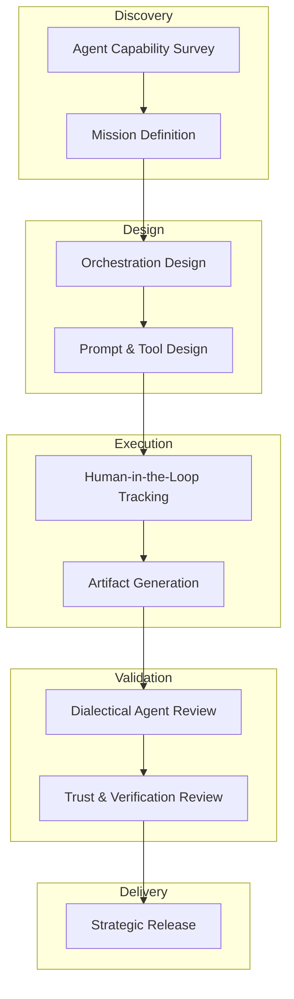

# Agentic R&D Workflow for Google Antigravity

This guide maps the **PhD Research Lifecycle** to the **Google Antigravity** agentic development platform. It allows researchers and engineers to orchestrate multiple AI agents across the Editor, Terminal, and Browser while maintaining rigorous scientific standards.

## 🔄 The Antigravity Research Loop

---

## 🛠 Phase Mapping

| PhD Skill | Antigravity Action | Purpose |
| :--- | :--- | :--- |
| **`sota-survey`** | **Agent Capability Survey** | Triage what current models can/cannot do in the workspace. |
| **`research-question`** | **Mission Definition** | Define clear Input/Output/Success criteria for the Agent. |
| **`phd-proposal`** | **Orchestration Design** | Map tasks to Editor, Terminal, and Browser agents. |
| **`research-design`** | **Prompt & Tool Design** | Design MCP tools and guardrails for the mission. |
| **`experiment-tracking`**| **HITL Tracking** | Monitor agent activity, artifacts, and verification results. |
| **`paper-writing`** | **Artifact Generation** | Synthesize code, PRs, and docs from agent outputs. |
| **`internal-critique`** | **Dialectical Review** | Use a "Critique Agent" to peer-review the "Builder Agent". |
| **`defense-prep`** | **Trust Review** | Present verification logs to human reviewers for approval. |

---

## 🚀 Execution Strategy in Antigravity

### 1. Unified Surface Orchestration
Leverage Antigravity's multi-surface capability:
- **Editor Agent:** Handles structural refactoring and code generation.
- **Terminal Agent:** Executes builds, runs tests, and monitors system logs.
- **Browser Agent:** Performs UX verification and frontend "browser-in-the-loop" testing.

### 2. Human-in-the-Loop (HITL)
Don't just watch the agents. Use the **Verification View** to:
- Intervene at critical decision points.
- Refine prompts based on "Verification Results".
- Approve artifacts before they hit the codebase.

### 3. Dialectical Verification
Set up a two-agent system within your workspace:
1. **Agent A (Builder):** Executes the primary mission.
2. **Agent B (Verifier):** Critiques the outputs of Agent A using the `internal-critique` skill logic.
