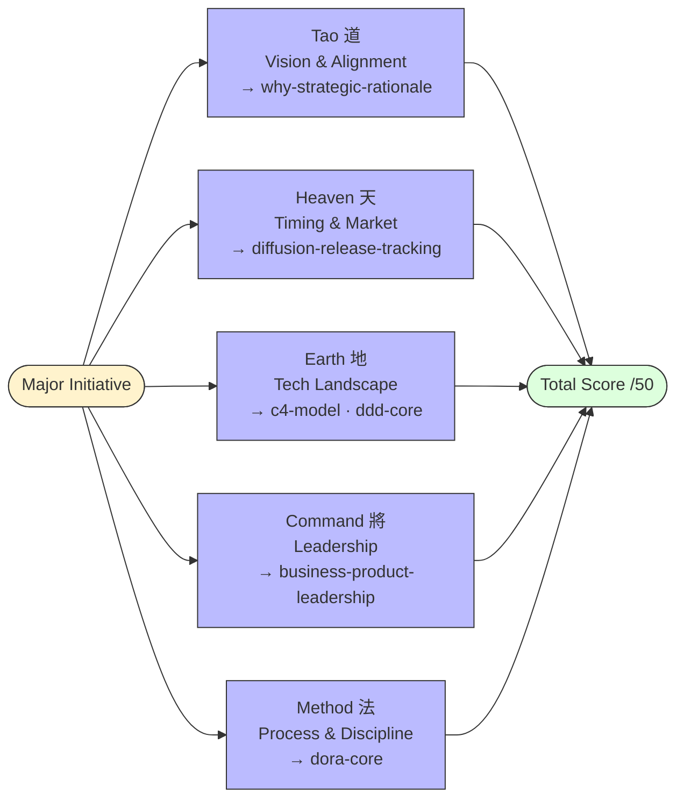

# Art of War for Software Engineering

Apply Sun Tzu's "The Art of War" principles to modern software development, product strategy, and engineering leadership. This guide acts as a **Strategic Audit Layer** — run it before any major initiative.

---

## 1. The Five Fundamental Factors (Ngũ Sự)

The five factors are **parallel evaluation criteria**, not a sequential pipeline. Score all five simultaneously before committing to an initiative.



### Factor Descriptions

| Factor | Assessment Question | Skill |
|:---|:---|:---|
| **Tao 道** | Is the business WHY crystal clear to every engineer? | `why-strategic-rationale` |
| **Heaven 天** | Is the market timing optimal? Too early or too late? | `diffusion-release-tracking` |
| **Earth 地** | Does the current tech stack support this naturally? Is tech debt too heavy? | `c4-model` · `ddd-core` |
| **Command 將** | Is there a clear, accountable owner for the technical vision? | `business-product-leadership` |
| **Method 法** | Is the CI/CD pipeline automated and disciplined? DORA metrics healthy? | `dora-core` |

---

## 2. Strategic Assessment Matrix

Score each factor 1–10. Total determines whether to proceed.

| Factor | Score /10 | Notes |
|:---|:---:|:---|
| **Tao** — WHY clear to team? | | |
| **Heaven** — Timing optimal? | | |
| **Earth** — Tech terrain navigable? | | |
| **Command** — Ownership clear? | | |
| **Method** — Pipeline disciplined? | | |
| **Total** | **/50** | |

**Verdict:**

| Score | Decision |
|:---|:---|
| **40–50** | Excellent positioning. Proceed at full speed. |
| **30–39** | Proceed with caution. Identify and fix weak factors first. |
| **< 30** | **STOP.** Re-evaluate strategy. Do not commit engineering resources. |

---

## 3. Strategic Stratagems → Product-Led Mapping

Each stratagem maps directly to a concrete Product-Led action.

### "Know Yourself, Know Your Enemy"
> "If you know the enemy and know yourself, you need not fear the result of a hundred battles."

→ Run `problem-discovery`: customer interviews + LMR (competitor landscape) + smoke tests.
Know your capabilities (tech debt, Core Domain) before knowing the market (competitors, gaps).

### "Win Without Fighting" (The Sheathed Sword)
> "The supreme art of war is to subdue the enemy without fighting."

→ Generic Subdomain = **buy or use SaaS, never build**. Auth, Payments, Email → Stripe, Auth0, SendGrid.
Save all engineering energy for the **Core Domain** — that's where you can actually win.

### "Avoid Strength, Attack Weakness"
> "Water runs away from high places and hastens downwards."

→ Beachhead strategy (Geoffrey Moore). Don't compete head-on with dominant players (strength).
Dominate one underserved niche completely (weakness), then cross the Chasm to the Early Majority.

### "Binh Như Nước" — Water Strategy (Adaptability)
> "Shape your flow according to the nature of the ground."

→ High Deployment Frequency (DORA) + Feature Flags. Loosely coupled architecture = fluid pivoting.
Architecture must be able to "flow" — tightly coupled monoliths are frozen water.

---

## 4. Integrated Workflow: Art of War + Product-Led

Art of War = **pre-flight checklist**. Product-Led = **execution playbook**.

```
┌─────────────────────────────────────────────────────────┐
│  BEFORE any initiative                                   │
│  Ngũ Sự Assessment (score /50)                          │
│  < 30 → Fix 2 lowest factors → re-assess                │
│  ≥ 30 → Proceed                                         │
└─────────────────────────┬───────────────────────────────┘
                          ↓
┌─────────────────────────────────────────────────────────┐
│  "Know your enemy"  →  problem-discovery                │
│  Interviews + LMR + competitor analysis                  │
│  Output: Problem Statement + beachhead niche             │
│  ("Attack weakness" = beachhead from competitor gap)     │
└─────────────────────────┬───────────────────────────────┘
                          ↓
┌─────────────────────────────────────────────────────────┐
│  "Establish Tao"  →  why-strategic-rationale            │
│  VPC + PR/FAQ → WHY Statement + Kill Criteria            │
│  Outputs: JTBD definition                                │
└─────────────────────────┬───────────────────────────────┘
                          ↓
┌─────────────────────────────────────────────────────────┐
│  "Map the Earth"  →  c4-model + ddd-core                │
│  "Win without fighting": Generic → buy/SaaS              │
│  Core Domain: build with full engineering effort         │
└─────────────────────────┬───────────────────────────────┘
                          ↓
┌─────────────────────────────────────────────────────────┐
│  "Water strategy"  →  Ship → Release (Rogers curve)     │
│  Feature flags → Early Adopters → Cross Chasm            │
│  DORA metrics = measure adaptability                     │
└─────────────────────────────────────────────────────────┘

Note: Ngũ Sự runs as audit layer at EACH step — not only at start.
```

---

## 5. Anti-Patterns

| Anti-pattern | Sun Tzu violation | Fix |
|:---|:---|:---|
| High Method, Zero Tao | Fighting without knowing WHY | Establish WHY Statement before any sprint |
| Build Generic Subdomains | Fighting where you can't win | Buy/SaaS for everything outside Core Domain |
| Compete head-on with dominant player | Attacking strength | Beachhead: find the underserved niche |
| Tightly coupled architecture | Frozen water, cannot adapt | Loosely coupled services + feature flags |
| Command without Method | Vision with no execution discipline | DORA audit before major release |
| Ignoring tech debt (Earth) | Crossing difficult terrain unprepared | C4/DDD audit: know your terrain before committing |

---

## 6. Connection to Master Framework

Art of War acts as a **Strategic Audit Layer** at each phase of the [Master Framework](./master-framework.md):

| Master Framework Layer | Ngũ Sự Audit |
|:---|:---|
| Layer 0 — WHY | Audit **Tao**: Does everyone know why? |
| Layer 1 — WHAT/WHEN | Audit **Heaven**: Is the market timing right? |
| Layer 2 — HOW DESIGN | Audit **Earth**: Does the tech terrain support this? |
| Layer 3 — HOW DELIVER | Audit **Command**: Is there clear ownership? |
| Layer 4 — HOW FAST | Audit **Method**: Is the pipeline disciplined? |
