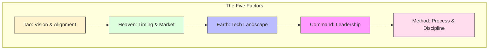

# Art of War for Software Engineering

Apply Sun Tzu's "The Art of War" principles to modern software development, product strategy, and engineering leadership. This guide helps evaluate strategic positioning and optimize resource allocation.

## 1. The Five Fundamental Factors (Ngũ Sự)

Before starting any major initiative, evaluate the five factors that determine success.

### Strategic Mapping:
- **Tao (The Way):** Shared vision. Connected to `why-strategic-rationale`.
- **Heaven:** External conditions. Connected to `diffusion-release-tracking`.
- **Earth:** Technical terrain. Connected to `c4-model` and `ddd-core`.
- **Command:** Leadership. Connected to `business-product-leadership`.
- **Method:** Operations. Connected to `dora-core` and `collaborative-engineering-agent`.

---

## 2. Strategic Stratagems

### Know Yourself, Know Your Enemy
Conduct a SWOT analysis aligned with the Five Factors. Understand your team's limits (tech debt) and the market's standards.

### The Sheathed Sword (Win Without Fighting)
If a feature is a "Generic Subdomain," **Buy, don't Build**. Save your engineering "energy" for the **Core Domain** where you can actually win.

### Avoid Strength, Attack Weakness
Don't attack a massive monolith directly. Build new value in isolated microservices (attacking weakness/unmet needs) rather than fighting entrenched legacy debt (attacking strength).

### The Water Strategy (Adaptability)
Architecture must be fluid. High **Deployment Frequency** allows you to pivot like water when the "Heaven" (market) changes.

---

## 3. Strategic Assessment Matrix

Use this matrix to audit your positioning before a "battle" (major release or project).

| Factor | Assessment Question | Target |
| :--- | :--- | :--- |
| **Tao** | Is the business value clear to every engineer? | 10/10 |
| **Heaven** | Is the timing optimal for this market release? | 10/10 |
| **Earth** | Does the current architecture support this naturally? | 10/10 |
| **Command** | Is there a clear, accountable technical owner? | 10/10 |
| **Method** | Is the delivery pipeline automated and disciplined? | 10/10 |

---

## 4. How to Use with the Master Framework

The **Art of War** skill acts as a **Strategic Audit Layer** across the [Master Framework](./master-framework.md):

1.  **Audit the Tao** before committing to Layer 0 (WHY).
2.  **Audit the Heaven** during Layer 1 (WHAT/WHEN).
3.  **Audit the Earth** during Layer 2 (HOW DESIGN).
4.  **Audit the Command & Method** during Layer 3 & 4 (HOW DELIVER/PERF).
