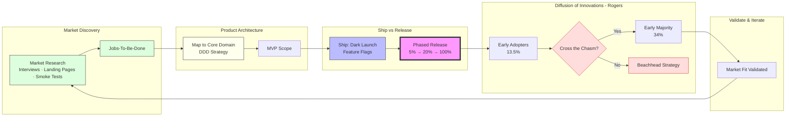

# Business & Product Leadership Guide

This guide outlines the strategic frameworks for Product Owners, Founders, and Business Leaders to ensure product-market fit and high-velocity delivery.

## 1. The Strategic Discovery-to-Delivery Flow



## 2. Evidence-Based Discovery (Market Validation)

Before writing a single line of code, validate demand using real-world signals.

> **For a complete multi-signal validation workflow**, use the `problem-discovery` skill — it covers Customer Interviews, Labor Market Research (LMR), Landing Page/Smoke Tests, and Competitor Analysis with a structured confidence assessment and Problem Statement output.

### Validation Methods:
- **Customer Interviews:** Talk to potential users — confirm the problem is real and painful.
- **Landing Page Tests:** Ship a landing page before the product; measure sign-up rate.
- **Smoke Tests:** Fake the feature, see if users try to use it (Wizard of Oz testing).
- **Labor Market Research (LMR):** Scan job boards for high-volume hiring in the problem domain — high hiring = companies paying humans to solve what could be automated. Best for B2B/developer tools.
- **Competitor Analysis:** Who else solves this? Differentiate on Price, Speed, Quality, or UX.

### Output:
A **Problem Statement** with confidence level (High/Medium/Low) → feeds into JTBD definition.

## 3. Jobs-To-Be-Done (JTBD) Framework

Users don't want a "feature"; they want to accomplish a "job".

### The JTBD Statement:
> "When **[Situation]**, I want to **[Motivation]**, so I can **[Expected Outcome]**."

### Applying JTBD to Product Design:
- **Functional Job:** The core task (e.g., "Send money to a friend") → maps to **Core Domain** in DDD.
- **Emotional Job:** How the user wants to feel (e.g., "Feel secure and generous") → informs UX.
- **Social Job:** How the user wants to be perceived → informs marketing and onboarding.

## 4. Product Architecture: DDD Integration

Map JTBD findings directly to technical design.

- **Core Domain:** The unique logic that directly solves the primary Job. Invest most engineering effort here.
- **Generic Subdomains:** Non-differentiating features (e.g., Auth, Payments). Buy or use SaaS — do not build from scratch.
- **Event Storming:** Use JTBD outcomes to define key **Domain Events** in the system.

## 5. Diffusion of Innovations (Rogers, 1962)

How your product spreads through the market determines release and feature strategy.

```
Innovators   Early       Early        Late         Laggards
  2.5%      Adopters    Majority     Majority       16%
            13.5%        34%          34%
    |_________|___________|____________|______________|
              ^           ^
           Target       "The Chasm"
           for MVP      (Geoffrey Moore)
```

| Segment | Mindset | What they need |
|---|---|---|
| **Innovators** | Risk-tolerant, tech-first | Access, raw capability |
| **Early Adopters** | Vision-driven, influential | Reference story, competitive edge |
| **Early Majority** | Pragmatic, wait-and-see | Proven ROI, whole product |
| **Late Majority** | Skeptical, price-sensitive | Standards, support, herd behavior |
| **Laggards** | Tradition-bound | Forced adoption or irrelevance |

**Crossing the Chasm:** Dominate one niche vertical completely (beachhead) before expanding. Early Adopters tolerate rough edges; Early Majority demands a complete solution.

## 6. Separation of Concerns: Ship vs. Release

| Concept | Action | Owner | Goal |
| :--- | :--- | :--- | :--- |
| **Ship** | Technical deployment to Production. | Engineering | Speed, Stability, CI/CD. |
| **Release** | Making the feature visible to users. | Product/Biz | Market Fit, Marketing, Revenue. |

### Tactical Implementation:
- **Feature Flags:** Always ship new code "dark" (hidden).
- **Canary Rollouts:** Release to 1%, 5%, then 100% of users — aligned with adoption curve.
- **Kill Switch:** Instantly disable a feature if business metrics drop, without redeploy.

## 7. The MVP Playbook

1. **Validate Demand:** Confirm the problem is real via interviews, landing pages, smoke tests.
2. **Define the Job (JTBD):** Focus on the one job that provides 80% of the value.
3. **Map to Core Domain:** Use Strategic DDD to isolate unique logic.
4. **Ship continuously:** Keep engineers shipping daily behind feature flags.
5. **Release to Early Adopters:** Validate market hypothesis before crossing the Chasm.
6. **Cross the Chasm:** Dominate a beachhead niche, then expand to Early Majority.
