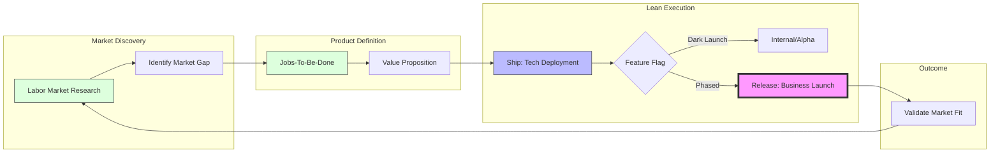

# Business & Product Leadership Guide

This guide outlines the strategic frameworks for Product Owners, Founders, and Business Leaders to ensure product-market fit and high-velocity delivery.

## 1. The Strategic Discovery-to-Delivery Flow

## 2. Evidence-Based Discovery (LMR)

**Labor Market Research (LMR)** is the process of using real-world data to validate demand before writing a single line of code.

### How to apply LMR:
- **Scan Job Boards/Marketplaces:** Identify what specific capabilities companies are currently hiring for or buying.
- **Identify the Skill Gap:** Look for areas where demand is high but supply (existing solutions/talents) is low or low-quality.
- **Validation:** Your MVP should target the most acute part of this gap.

## 3. Jobs-To-Be-Done (JTBD) Framework

Users don't want a "feature"; they want to accomplish a "job".

### The JTBD Statement:
> "When **[Situation]**, I want to **[Motivation]**, so I can **[Expected Outcome]**."

### Applying JTBD to Product Design:
- **Functional Job:** The core task (e.g., "Send money to a friend").
- **Emotional Job:** How the user wants to feel (e.g., "Feel secure and generous").
- **Social Job:** How the user wants to be perceived (e.g., "Be seen as a tech-savvy person").

*Strategy: Design your Core Domain (DDD) around the Functional Job, and your UI/UX around the Emotional/Social Jobs.*

## 4. Separation of Concerns: Ship vs. Release

One of the most powerful mindset shifts for a leader is decoupling technical readiness from business readiness.

| Concept | Action | Owner | Goal |
| :--- | :--- | :--- | :--- |
| **Ship** | Technical deployment to Production. | Engineering | Speed, Stability, CI/CD. |
| **Release** | Making the feature visible to users. | Product/Biz | Market Fit, Marketing, Revenue. |

### Tactical Implementation:
- **Feature Flags:** Always ship new code "dark" (hidden).
- **Canary Rollouts:** Release to 1%, 5%, then 100% of users.
- **Kill Switch:** Instantly turn off a feature if business metrics drop, without a redeploy.

## 5. The MVP Playbook for Founders

1.  **Validate Demand (LMR):** Confirm people actually have the problem.
2.  **Define the Job (JTBD):** Focus on the one job that provides 80% of the value.
3.  **Map to Core Domain:** Use **Strategic DDD** to isolate the unique logic.
4.  **Continuous Shipping:** Keep the engineers shipping code daily.
5.  **Strategic Release:** Release the MVP only when the market positioning is ready.
