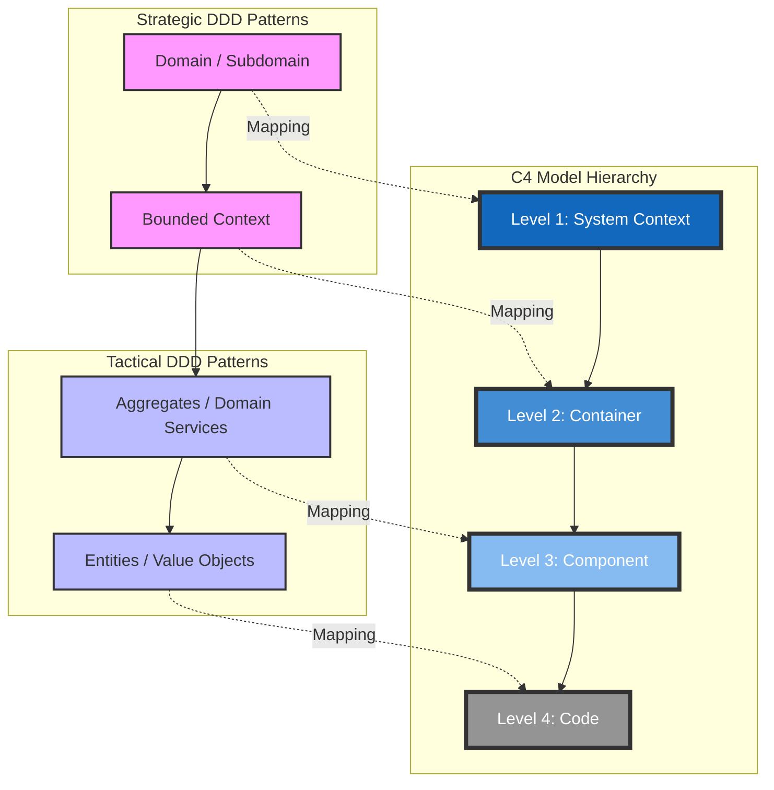

# C4 Model & Domain-Driven Design (DDD) Mapping Guide

This guide explains how to integrate the **DDD** methodology with the **C4 Model** for a cohesive architectural visualization.

For high-level business strategy (LMR, JTBD, Ship vs. Release), please refer to the [Business & Product Leadership Guide](./business-product-leadership.md).

## 1. The Core Mapping Matrix

The key to successful integration is aligning the levels of abstraction from domain discovery to technical implementation.

| C4 Level | DDD Strategic/Tactical Pattern | Focus | Visualization Goal |
| :--- | :--- | :--- | :--- |
| **L1: System Context** | **Domain / Subdomain** | Business Landscape | Shows how the domain fits into the wider ecosystem. |
| **L2: Container** | **Bounded Context** | Consistency Boundary | Each Container (Microservice) represents ONE Bounded Context. |
| **L3: Component** | **Aggregates & Services** | Internal Logic | Zooms into a Bounded Context to show Aggregate Roots. |
| **L4: Code** | **Entities & Value Objects** | Implementation | Shows actual classes and rich domain behavior. |

## 2. Visualizing the Relationship (Mermaid)

## 3. Best Practices for Design-to-Code Sync

1.  **Bounded Context as the Container Boundary**:
    - Each Container (L2) must own its data schema. Avoid "Shared Kernel" databases.
    - If a Bounded Context is split across containers (e.g., API + Worker), they must share the same **Ubiquitous Language**.

2.  **Aggregates as L3 Components**:
    - Treat each **Aggregate Root** as a primary component in Level 3. This highlights transactional boundaries.

3.  **Language Consistency**:
    - Ensure names in your C4 diagrams match the **Ubiquitous Language** defined in your DDD workshops.

## 4. The DDD-C4 Feedback Loop

Architecture is iterative. Use this loop to continuously improve your design:

1.  **Design with DDD**: Define your Bounded Contexts and Aggregates.
2.  **Visualize with C4**: Draw the L2 and L3 diagrams.
3.  **Analyze the Visuals**: 
    - Does an L2 Container have too many incoming/outgoing arrows? (High Coupling).
    - Are the responsibilities in the L2 description blurred? (Poorly defined Bounded Context).
4.  **Refactor with DDD**: Re-draw the boundaries in your Domain Model to simplify the C4 visualization.
5.  **Sync to Code**: Update the actual folder structure and implementation.
