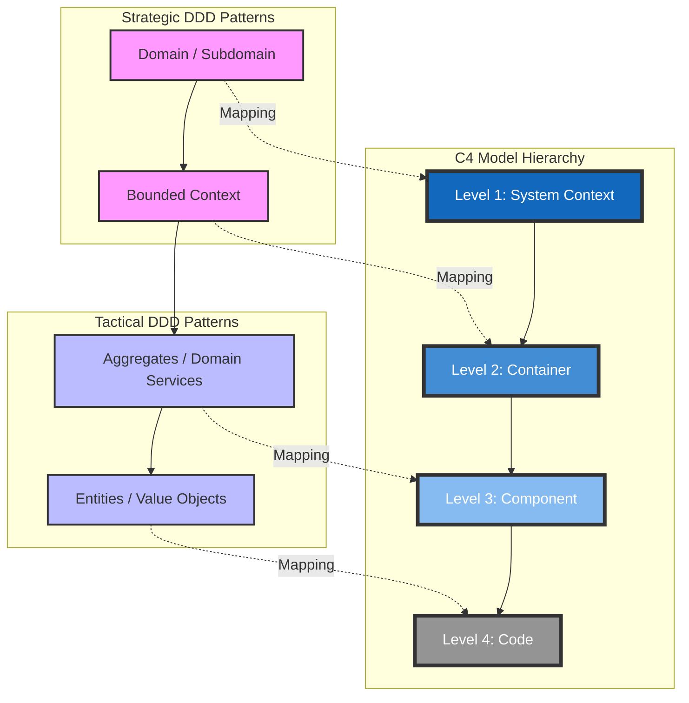

# C4 Model & Domain-Driven Design (DDD) Mapping Guide

This guide explains how to integrate the **DDD** methodology with the **C4 Model** for a cohesive architectural visualization that stays true to business logic.

## 1. The Core Mapping Matrix

The key to successful integration is aligning the levels of abstraction. Think of DDD as the **strategy** and C4 as the **visualization**.

| C4 Level | DDD Strategic/Tactical Pattern | Focus | Visualization Goal |
| :--- | :--- | :--- | :--- |
| **L1: System Context** | **Domain / Subdomain** | Business Landscape | Shows how the entire business domain interacts with users and external systems. |
| **L2: Container** | **Bounded Context** | Consistency Boundary | Each Container (Microservice, API) should ideally represent ONE Bounded Context. |
| **L3: Component** | **Aggregates & Services** | Internal Organization | Zooms into a Bounded Context to show Aggregate Roots and Domain Services. |
| **L4: Code** | **Entities & Value Objects** | Implementation Details | Shows the internal classes, VOs, and relationships within a component. |

## 2. Visualizing the Relationship (Mermaid)

## 3. Best Practices for Design-to-Code Sync

1.  **Bounded Context as the Container Boundary**:
    - Avoid "Shared Kernel" databases. Each Container (L2) must own its data schema for its specific Bounded Context.
    - If a Bounded Context is split across containers (e.g., API + Worker), they must share the same **Ubiquitous Language**.

2.  **Aggregates as L3 Components**:
    - When drawing Level 3, treat each **Aggregate Root** as a primary component. This highlights the transactional boundaries and consistency rules of your domain.

3.  **Context Mapping at L2**:
    - Use the arrows in your C4 Container diagram to represent DDD relationship patterns:
        - **ACL (Anti-Corruption Layer)**: Use for downstream integration with legacy or third-party systems.
        - **OHS (Open Host Service)**: Use when providing a public API for other contexts.

4.  **Language Consistency**:
    - Ensure that the names used in your C4 diagrams (L1-L4) match the **Ubiquitous Language** defined in your DDD workshop (Event Storming).

## 4. Workflow Recommendation

1.  **Event Storming**: Discover Domain Events, Commands, and Aggregates.
2.  **Define Bounded Contexts**: Group Aggregates and identify boundaries.
3.  **Draw C4 Level 1**: Show the high-level business context.
4.  **Draw C4 Level 2**: Map each Bounded Context to a Container (Microservice/API).
5.  **Draw C4 Level 3**: For complex domains, zoom in to show Aggregates and Services.
6. **Code Synthesis**: Implement using the `ddd-tactical` building blocks (Entities, VOs, Repositories).

## 5. The DDD-C4 Feedback Loop

Architecture is iterative. Use this loop to continuously improve your design:

1.  **Design with DDD**: Define your Bounded Contexts and Aggregates.
2.  **Visualize with C4**: Draw the L2 and L3 diagrams.
3.  **Analyze the Visuals**: 
    - Does an L2 Container have too many incoming/outgoing arrows? (High Coupling).
    - Are the responsibilities in the L2 description blurred? (Poorly defined Bounded Context).
    - Is an L3 Component (Aggregate) doing too much? (Violation of Single Responsibility).
4.  **Refactor with DDD**: Re-draw the boundaries in your Domain Model to simplify the C4 visualization.
5.  **Sync to Code**: Update the actual folder structure and implementation based on the refined design.
