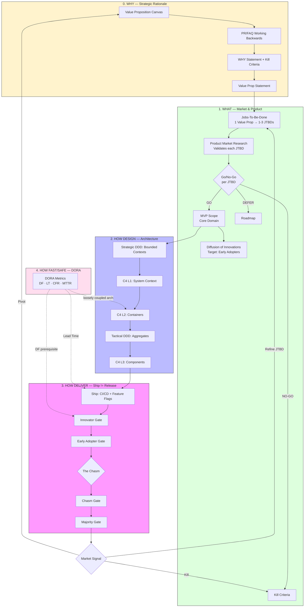

# Product-Led Engineering: The Master Framework

Integrates **Business Strategy** with **Technical Architecture** and **Delivery Performance** — from idea validation to high-velocity production delivery.

## 1. The End-to-End Unified Flow

### The JTBD → Value Prop → PMR Core Flow

```
┌─────────────────────────────────────────────────────────────────────────────┐
│                         WHY Layer (Strategy)                                │
│  ┌─────────────────┐                                                        │
│  │ Value Prop      │  "[Product] helps [Customer] [solve Problem]           │
│  │ Statement       │   by [Approach], resulting in [Gain]"                 │
│  │ (from VPC)      │                                                        │
│  └────────┬────────┘                                                        │
│           │                                                                 │
│           ▼  1 Value Prop → 1-3 JTBDs                                       │
│  ┌─────────────────────────────────────────────────────────────────────┐   │
│  │                        WHAT Layer (Product)                          │   │
│  │  ┌─────────────────┐     ┌──────────────────┐     ┌──────────────┐  │   │
│  │  │ JTBD #1         │     │ JTBD #2          │     │ JTBD #3      │  │   │
│  │  │ "When [S], I    │     │ "When [S], I     │     │ (if needed)  │  │   │
│  │  │  want [M], so   │     │  want [M], so    │     │              │  │   │
│  │  │  I can [O]"     │     │  I can [O]"      │     │              │  │   │
│  │  └────────┬────────┘     └────────┬─────────┘     └──────┬───────┘  │   │
│  │           │                       │                      │          │   │
│  │           └───────────────────────┼──────────────────────┘          │   │
│  │                                   ▼                                 │   │
│  │  ┌─────────────────────────────────────────────────────────────┐   │   │
│  │  │              VALIDATE Layer (PMR)                            │   │   │
│  │  │  ┌─────────────┐  ┌─────────────┐  ┌─────────────────────┐  │   │   │
│  │  │  │ Interviews  │  │ Surveys     │  │ Landing Page /      │  │   │   │
│  │  │  │ (qualitative)│  │ (quantitative)│  │ Behavioral Data    │  │   │   │
│  │  │  └──────┬──────┘  └──────┬──────┘  └──────────┬──────────┘  │   │   │
│  │  │         │                │                    │             │   │   │
│  │  │         └────────────────┼────────────────────┘             │   │   │
│  │  │                          ▼                                  │   │   │
│  │  │  ┌─────────────────────────────────────────────────────┐   │   │   │
│  │  │  │  Go/No-Go per JTBD:                                 │   │   │   │
│  │  │  │  ✅ GO      → Include in MVP Core Domain             │   │   │   │
│  │  │  │  ⚠️ DEFER   → Add to roadmap                         │   │   │   │
│  │  │  │  ❌ NO-GO   → Drop from scope                        │   │   │   │
│  │  │  └─────────────────────────────────────────────────────┘   │   │   │
│  │  └─────────────────────────────────────────────────────────────┘   │   │
│  └─────────────────────────────────────────────────────────────────────┘   │
│           │                                                                 │
│           ▼                                                                 │
│  ┌─────────────────────────────────────────────────────────────────────┐   │
│  │  MVP Scope: Core Domain (JTBDs validated) + Beachhead segment       │   │
│  └─────────────────────────────────────────────────────────────────────┘   │
└─────────────────────────────────────────────────────────────────────────────┘
```

### Full End-to-End Flow



---

## 2. The 5-Layer Stack

| Layer | Question | Skill | Output |
|:---|:---|:---|:---|
| **Second Brain** | What did we learn? | `second-brain-reflection` | Compressed Rules & Lessons |
| **Strategy Audit** | Are we positioned to win? | `art-of-war-software-engineering` | Strategic Assessment Matrix |
| **0. WHY** | Why should this exist? | `why-strategic-rationale` | WHY Statement + Kill Criteria |
| **0. VALIDATE** | Does this problem exist? | `problem-discovery` | Problem Statement + confidence level |
| **1. WHAT** | What do we build? | `business-product-leadership` | JTBD + Rogers adoption target |
| **1. WHEN** | When do we release? | `diffusion-release-tracking` | Go/No-Go per Rogers gate |
| **1. METRICS** | How do we measure? | `product-analytics` | NSM, funnels, cohorts, experiments |
| **1. UX** | How do users experience it? | `product-ux-research` | Personas, journey maps, usability |
| **2. HOW DESIGN** | How do we design it? | `ddd-core` + `c4-model` + `clean-architecture` | Bounded Contexts + C4 diagrams + Dependency Rule |
| **3. HOW DELIVER** | How do we ship it? | `collaborative-engineering-agent` | Atomic PRs, DRE, GitOps |
| **4. HOW FAST/SAFE** | How fast and safe? | `dora-core` | DF/LT/CFR/MTTR tier assessment |

---

## 3. Integrated Workflow Reference

| Phase | Methodology | Goal | Skill |
|:---|:---|:---|:---|
| **Audit** | The Five Factors (Ngũ Sự) | Evaluate strategic positioning | `art-of-war-software-engineering` |
| **Validate WHY** | VPC + PR/FAQ | Confirm WHY before building | `why-strategic-rationale` |
| **Validate Problem** | Interviews + LMR + smoke tests | Confirm problem is real | `problem-discovery` |
| **Discover** | Product Market Research + JTBD | Understand the Job to be done | `business-product-leadership` |
| **Measure** | Product analytics + A/B testing | Define metrics and validate impact | `product-analytics` |
| **Research** | UX research + usability testing | Understand user behavior and pain points | `product-ux-research` |
| **Scope** | Strategic DDD + C4 L1 | Define boundaries and ecosystem | `ddd-core` + `c4-level1-context` |
| **Design** | Tactical DDD + C4 L2/L3 + Clean Architecture | Design internal domain logic | `ddd-tactical` + `c4-level2-container` + `clean-architecture` |
| **Ship** | CI/CD + Feature Flags | Deploy without business risk | `collaborative-engineering-agent` |
| **Release** | Rogers Gates + Go/No-Go | Expand rollout by adoption signal | `diffusion-release-tracking` |
| **Measure** | DORA metrics | Track delivery performance | `dora-core` |

---

## 4. Key Integration Points

### The JTBD → Value Prop → PMR Chain

**WHY → Value Prop → JTBD:**
```
VPC Customer Jobs/Pains/Gains
    ↓
Value Prop Statement: "[Product] helps [Customer] [solve Problem] by [Approach]"
    ↓
1 Value Prop → 1-3 JTBDs:
  • Customer Segment → JTBD Situation ("When...")
  • Core Problem → JTBD Motivation ("I want to...")
  • Measurable Gain → JTBD Expected Outcome ("so I can...")
```

**JTBD → PMR → MVP:**
```
Each JTBD component → PMR validates:
  • Situation (frequency) → Interviews: "How often?" (≥ 3x/week)
  • Motivation (pain severity) → Survey: "Rate pain 1-10" (≥ 40% rate 7+)
  • Expected Outcome (value) → Landing page conversion (≥ 5% cold traffic)
  • Willingness to pay → Van Westendorp pricing (clear acceptable range)
    ↓
Go/No-Go per JTBD:
  ✅ GO → Include in MVP Core Domain
  ⚠️ DEFER → Add to roadmap
  ❌ NO-GO → Drop from scope
```

**Critical rule:** JTBD must be defined BEFORE PMR. You cannot validate what you haven't articulated.

### Cross-Layer Integration Points

**problem-discovery → WHY:** Problem Statement (confidence: High/Medium/Low) feeds VPC Customer Profile. Low confidence = do not proceed to WHY Statement. Beachhead niche from competitor analysis becomes JTBD target segment.

**WHY → WHAT:** VPC Customer Jobs feed directly into JTBD Situation + Motivation. If VPC shows no Problem-Solution Fit, stop — don't proceed to JTBD.

**WHAT → METRICS:** JTBD defines the North Star Metric (what value looks like). `product-analytics` creates the metrics hierarchy, funnel, and cohort tracking to measure progress toward the JTBD outcome.

**WHAT → UX:** JTBD informs persona creation and journey mapping in `product-ux-research`. The "aha moment" in the journey map becomes the activation metric in analytics.

**METRICS → RELEASE:** `product-analytics` provides the quantitative signals (activation rate, retention, NPS) that `diffusion-release-tracking` uses for Go/No-Go gate decisions.

**UX → DESIGN:** Usability testing findings from `product-ux-research` feed into `c4-level3-component` and `ddd-tactical` design decisions. Pain points in the journey map become domain events in DDD Event Storming.

**WHAT → WHEN:** Rogers adoption target (Early Adopters first) determines gate strategy. JTBD defines what "activation" means for each gate's signal criteria.

**DORA → WHEN:** Deployment Frequency is a prerequisite for Rogers gate cadence. Low DF (monthly) = cannot run meaningful phased rollouts.

**DORA → HOW DESIGN:** Loosely Coupled Architecture (DORA Capability #1) is achieved through DDD Bounded Contexts + independent C4 L2 containers + Clean Architecture's Package by Component. Conway's Law: org structure must match desired architecture.

**HOW DESIGN → HOW DELIVER:** C4 L2 containers define independent Ship units. Each container, structured with Clean Architecture (Entities → Use Cases → Adapters), can be shipped behind a feature flag independently.

---

### The C4 + DDD + Clean Architecture Trinity

Three complementary frameworks for architecture:

```
┌─────────────────────────────────────────────────────────────────────────────┐
│                     C4 MODEL — "How to communicate"                          │
│  L1 Context → L2 Containers → L3 Components → L4 Code                        │
│  "Who uses the system?" → "What are the deployable units?"                   │
│    → "What's inside each unit?" → "How is it implemented?"                   │
│                                                                             │
│  C4 answers: WHAT does the architecture look like at different zoom levels?  │
└─────────────────────────────────────────────────────────────────────────────┘
                                      │
                                      ▼
┌─────────────────────────────────────────────────────────────────────────────┐
│              DOMAIN-DRIVEN DESIGN — "What to build"                          │
│  Strategic: Bounded Contexts, Ubiquitous Language, Context Maps              │
│  Tactical: Aggregates, Entities, Value Objects, Domain Services              │
│                                                                             │
│  DDD answers: WHAT is the domain model? Where are the boundaries?            │
└─────────────────────────────────────────────────────────────────────────────┘
                                      │
                                      ▼
┌─────────────────────────────────────────────────────────────────────────────┐
│           CLEAN ARCHITECTURE — "How to structure code"                       │
│  Dependency Rule: Dependencies point inward                                  │
│  Layers: Entities → Use Cases → Interface Adapters → Frameworks              │
│  Package by Component: Self-contained packages per C4 L3 Component           │
│                                                                             │
│  Clean Architecture answers: HOW do we protect business logic from           │
│  framework changes? How do we make the code testable?                        │
└─────────────────────────────────────────────────────────────────────────────┘
```

**Integration workflow:**
```
Step 1: DDD Strategic (ddd-core)
  → Event Storming → Bounded Contexts → Ubiquitous Language
        ↓
Step 2: C4 L1 + L2 (c4-model)
  → Map Bounded Contexts to Systems/Containers
  → Define external actors and system boundaries
        ↓
Step 3: DDD Tactical (ddd-tactical)
  → Design Aggregates, Entities, Value Objects within each BC
        ↓
Step 4: Clean Architecture (clean-architecture)
  → Structure each C4 L3 Component as Package by Component
  → Entities (inner) → Use Cases (middle) → Adapters (outer)
        ↓
Step 5: C4 L3 + L4 (c4-level3-component, c4-level4-code)
  → Document component internals
  → UML class diagrams for complex Entities
```

**Key principle:** C4 shows the *structure*, DDD discovers the *domain*, Clean Architecture protects the *boundaries*. Use all three together.

---

## 5. The Continuous Alignment Loop

1. **Signal → WHY:** Market feedback from Rogers gates can falsify the WHY thesis → trigger kill criteria or pivot back to VPC
2. **WHY → JTBD:** Kill criteria update MVP scope, which updates the Core Domain boundary
3. **JTBD → Architecture:** Core Domain changes propagate to C4 L2 redesign and DDD Event Storming
4. **Architecture → DORA:** Tightly coupled containers degrade Deployment Frequency → DORA bottleneck → fix architecture first

---

## 6. How to Use This Repository

| Role | Start Here |
|:---|:---|
| **Founder / PM** | `problem-discovery` → `why-strategic-rationale` → `business-product-leadership` → `product-analytics` → `product-ux-research` → `diffusion-release-tracking` |
| **Architect** | `ddd-core` → `c4-model` → `clean-architecture` → `dora-core` (loosely coupled arch) |
| **Engineering Lead** | `dora-core` → `collaborative-engineering-agent` → `diffusion-release-tracking` |
| **Full Team** | Use the **5-Layer Stack** above as shared vocabulary across all roles |

**Claude Code install:**
```
/plugin marketplace add kinhluan/skills
/plugin install kinhluan-skills
/reload-plugins
```
