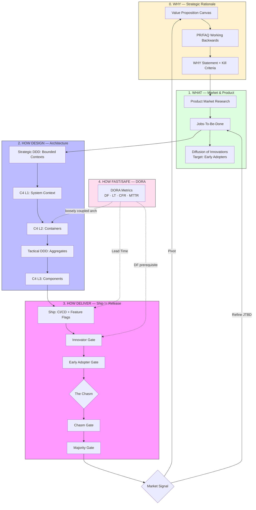

# Product-Led Engineering: The Master Framework

Integrates **Business Strategy** with **Technical Architecture** and **Delivery Performance** — from idea validation to high-velocity production delivery.

## 1. The End-to-End Unified Flow



---

## 2. The 5-Layer Stack

| Layer | Question | Skill | Output |
|:---|:---|:---|:---|
| **Second Brain** | What did we learn? | `second-brain-reflection` | Compressed Rules & Lessons |
| **Strategy Audit** | Are we positioned to win? | `art-of-war-software-engineering` | Strategic Assessment Matrix |
| **0. WHY** | Why should this exist? | `why-strategic-rationale` | WHY Statement + Kill Criteria |
| **1. WHAT** | What do we build? | `business-product-leadership` | JTBD + Rogers adoption target |
| **1. WHEN** | When do we release? | `diffusion-release-tracking` | Go/No-Go per Rogers gate |
| **2. HOW DESIGN** | How do we design it? | `ddd-core` + `c4-model` | Bounded Contexts + C4 diagrams |
| **3. HOW DELIVER** | How do we ship it? | `collaborative-engineering-agent` | Atomic PRs, DRE, GitOps |
| **4. HOW FAST/SAFE** | How fast and safe? | `dora-core` | DF/LT/CFR/MTTR tier assessment |

---

## 3. Integrated Workflow Reference

| Phase | Methodology | Goal | Skill |
|:---|:---|:---|:---|
| **Audit** | The Five Factors (Ngũ Sự) | Evaluate strategic positioning | `art-of-war-software-engineering` |
| **Validate** | VPC + PR/FAQ | Confirm WHY before building | `why-strategic-rationale` |
| **Discover** | Product Market Research + JTBD | Understand the Job to be done | `business-product-leadership` |
| **Scope** | Strategic DDD + C4 L1 | Define boundaries and ecosystem | `ddd-core` + `c4-level1-context` |
| **Design** | Tactical DDD + C4 L2/L3 | Design internal domain logic | `ddd-tactical` + `c4-level2-container` |
| **Ship** | CI/CD + Feature Flags | Deploy without business risk | `collaborative-engineering-agent` |
| **Release** | Rogers Gates + Go/No-Go | Expand rollout by adoption signal | `diffusion-release-tracking` |
| **Measure** | DORA metrics | Track delivery performance | `dora-core` |

---

## 4. Key Integration Points

**WHY → WHAT:** VPC Customer Jobs feed directly into JTBD Situation + Motivation. If VPC shows no Problem-Solution Fit, stop — don't proceed to JTBD.

**WHAT → WHEN:** Rogers adoption target (Early Adopters first) determines gate strategy. JTBD defines what "activation" means for each gate's signal criteria.

**DORA → WHEN:** Deployment Frequency is a prerequisite for Rogers gate cadence. Low DF (monthly) = cannot run meaningful phased rollouts.

**DORA → HOW DESIGN:** Loosely Coupled Architecture (DORA Capability #1) is achieved through DDD Bounded Contexts + independent C4 L2 containers. Conway's Law: org structure must match desired architecture.

**HOW DESIGN → HOW DELIVER:** C4 L2 containers define independent Ship units. Each container can be shipped behind a feature flag independently.

---

## 5. The Continuous Alignment Loop

1. **Signal → WHY:** Market feedback from Rogers gates can falsify the WHY thesis → trigger kill criteria or pivot back to VPC
2. **WHY → JTBD:** Kill criteria update MVP scope, which updates the Core Domain boundary
3. **JTBD → Architecture:** Core Domain changes propagate to C4 L2 redesign and DDD Event Storming
4. **Architecture → DORA:** Tightly coupled containers degrade Deployment Frequency → DORA bottleneck → fix architecture first

---

## 6. How to Use This Repository

| Role | Start Here |
|:---|:---|
| **Founder / PM** | `why-strategic-rationale` → `business-product-leadership` → `diffusion-release-tracking` |
| **Architect** | `ddd-core` → `c4-model` → `dora-core` (loosely coupled arch) |
| **Engineering Lead** | `dora-core` → `collaborative-engineering-agent` → `diffusion-release-tracking` |
| **Full Team** | Use the **5-Layer Stack** above as shared vocabulary across all roles |

**Claude Code install:**
```
/plugin marketplace add kinhluan/skills
/plugin install kinhluan-skills
/reload-plugins
```
