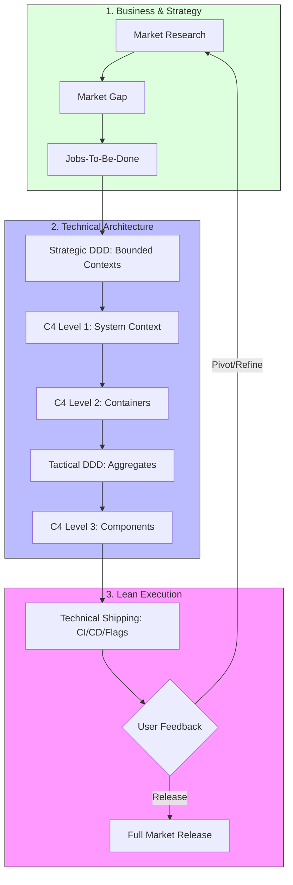

# Product-Led Engineering: The Master Framework

This master guide integrates **Business Strategy** with **Technical Architecture** to create a seamless flow from market discovery to high-velocity code delivery.

## 1. The End-to-End Unified Flow

This diagram shows how all the components in this repository work together.

## 2. Integrated Workflow Reference

| Phase | Methodology | Goal | Reference Guide |
| :--- | :--- | :--- | :--- |
| **Discovery** | LMR & JTBD | Validate Market Demand | [Business Leadership](./business-product-leadership.md) |
| **Scoping** | Strategic DDD & C4 L1 | Define Boundaries & Ecosystem | [C4 & DDD Mapping](./ddd-c4-mapping.md) |
| **Design** | Tactical DDD & C4 L2/3 | Design Internal Domain Logic | [C4 & DDD Mapping](./ddd-c4-mapping.md) |
| **Delivery** | Ship != Release | Decouple Tech vs Business Risk | [Business Leadership](./business-product-leadership.md) |

## 3. The Continuous Alignment Loop

1.  **Business to Tech:** JTBD defines the **Core Domain**. If it's not core to the job, don't over-engineer it.
2.  **Tech to Business:** C4 Level 2 diagrams identify **Independent Ship Units**. Use this to plan your MVP release phases.
3.  **Market to Design:** User feedback from a "Ship" (behind flags) should immediately inform the next iteration of **Event Storming** and **Aggregate** design.

---

## 🚀 How to use this Repository

1.  **For Founders/PMs:** Start with the [Business & Product Leadership Guide](./business-product-leadership.md).
2.  **For Architects:** Start with the [C4 Model & DDD Mapping Guide](./ddd-c4-mapping.md).
3.  **For Teams:** Use the **Master Flow** above to ensure everyone speaks the same **Ubiquitous Language**.
