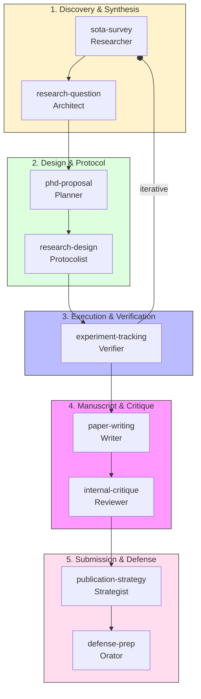

# Agentic PhD Research Framework: The Master Guide

This guide unifies the **PhD Research Lifecycle** with multi-agent orchestration, ensuring high-fidelity discovery, rigorous experimental tracking, and formal academic writing standards across any platform (Gemini, Claude, Antigravity).

## 1. The Research Lifecycle (Feynman-Style)

The framework follows a self-correcting loop where different Agent Personas collaborate through a sequence of specialized skills.



---

## 2. Agent Personas & Artifact Contracts

Every skill in the framework is assigned a specialized role and an Input/Output (I/O) contract to ensure data flow between agents.

| Skill | Agent Persona | Input Artifact | Output Artifact |
| :--- | :--- | :--- | :--- |
| **`sota-survey`** | **Academic Researcher** | Keywords / Topic | `sota-matrix.md` |
| **`research-question`** | **Research Architect** | `sota-matrix.md` | `rq-statement.md` |
| **`phd-proposal`** | **PhD Planner** | `rq-statement.md` | `proposal_v1.md` |
| **`research-design`** | **Protocolist** | `rq-statement.md` | `protocol.json` |
| **`experiment-tracking`** | **Experimental Verifier** | `protocol.json` | `results.csv` |
| **`paper-writing`** | **Scientific Writer** | `results.csv` + `notes/` | `manuscript.tex` |
| **`internal-critique`** | **Brutal Reviewer** | `manuscript.tex` | `critique-report.md` |
| **`publication-strategy`**| **Submission Strategist** | `critique-report.md` | `rebuttal_draft.md` |

---

## 3. The Research Workspace Standard

The `research-workspace-standard` ensures your project is readable by any agent, regardless of complexity.

### 🏛 Decision Hierarchy (Lex Specialis)
Agents resolve conflicts using a legal-style priority ladder:
1. **Tier 1: `WORKSPACE.md` (Highest)** — Project-specific mappings and domain constraints.
2. **Tier 2: `GEMINI.md` / `CLAUDE.md`** — Repository-wide mandates and standards.
3. **Tier 3: `MEMORY.md`** — Personal preferences and cross-project lessons.
4. **Tier 4: System Defaults (Lowest)** — Default AI behaviors.

### 📦 Hybrid Mapping (Monorepos & Submodules)
For existing codebases, create a **`WORKSPACE.md`** at the root to map logical roles to existing folders:
```markdown
# Research Workspace Map
- **Architecture:** `docs/architecture/`
- **Sub-module Research:** `packages/core/benchmarks/`
- **Cross-Linkage:** `../neighbor-project/research/notes/`
```

---

## 4. Linguistic Rigor & Evolution

High-quality research requires precise language. The framework enforces this through:
- **`vietnamese-cs-terminology`**: Standardizing Sino-Vietnamese (Hán-Việt) terms (HUST/VNU standards).
- **`technical-english-cs`**: Elevating diction (Leverage, Mitigate, Facilitate) for IEEE/ACM papers.
- **`vietnamese-writing-standard`**: Sanitizing AI-isms (fixing unnecessary capitalization and fillers).

### 🔄 The "Closing Ritual"
At the end of every session, the Agent MUST update the `## 🧠 Recent Insights` section in `WORKSPACE.md` to ensure the "Living Knowledge" is preserved for the next session.

---

## 5. How to Activate the Framework

1.  **Initialize:** Call *"setup research workspace"* to create folders or the `WORKSPACE.md` map.
2.  **Synchronize:** Link your `WORKSPACE.md` and `MEMORY.md` to establish the Decision Hierarchy.
3.  **Execute:** Trigger specific skills (e.g., *"Survey SOTA on LLM latency"*) and watch the agents build the artifact pipeline.
