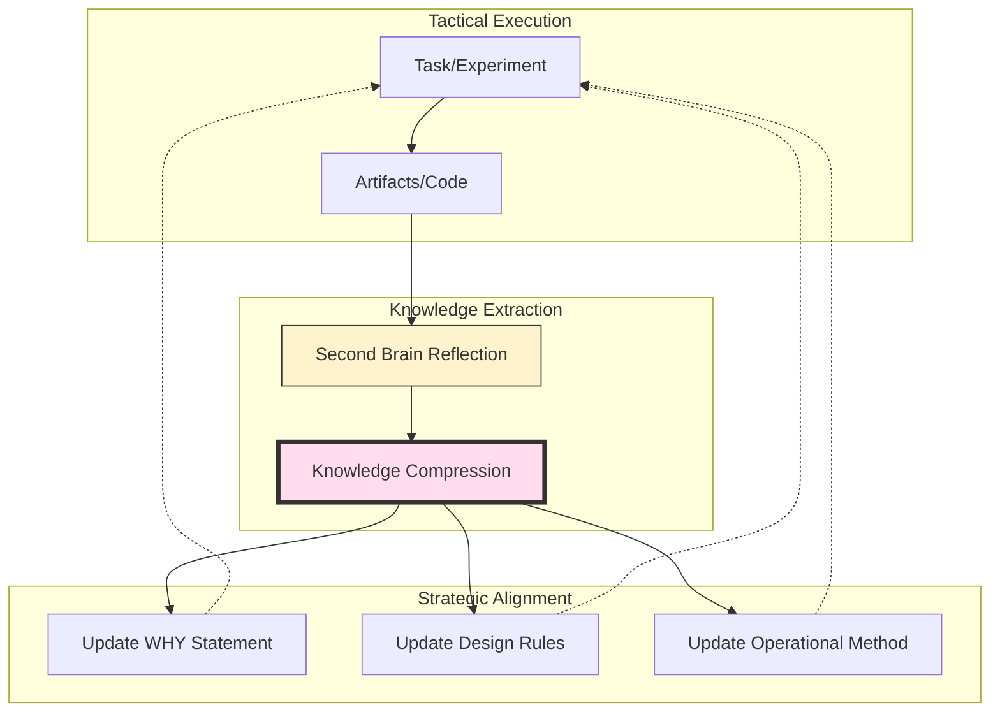

# Second Brain: Strategic Knowledge Compression

This guide outlines the continuous learning and knowledge management system for the **Product-Led Engineering** framework. It transforms linear execution into a self-evolving loop using **Knowledge Compression** and the **Art of War** strategic audit.

## 1. The Continuous Learning Loop

The Second Brain acts as the "Memory Layer" that sits between the **Master Framework** (Strategic Orientation) and **Antigravity** (Tactical Execution).

---

## 2. Integration with Strategic Frameworks

### ⚔️ Art of War Audit (Reflection)
After every major task, evaluate the **Five Fundamental Factors** to extract lessons:
- **Tao (Alignment):** Did we drift from the mission? Why?
- **Heaven (Timing):** Did market/context shifts affect the result?
- **Earth (Terrain):** What technical debt or architectural traps were discovered?
- **Command (Leadership):** Were the decisions data-driven or intuitive?
- **Method (Discipline):** Which parts of the SDLC failed or exceeded expectations?

### 🚀 Product-Led Engineering (Feedback)
Compressed knowledge is injected back into the 5-Layer Stack:
- **To Layer 0 (WHY):** Lessons regarding product-market fit or kill criteria.
- **To Layer 2 (HOW DESIGN):** New architectural constraints or DDD patterns.
- **To Layer 4 (PERF):** Operational optimizations to improve DORA metrics.

---

## 3. The Knowledge Compression Engine

To save tokens and maintain a high-signal context window, raw reflections are compressed into **Rules** and **Stratagems**.

| Feature | Original Reflection | Compressed Knowledge (Terse) |
| :--- | :--- | :--- |
| **Tech Choice** | "We tried using library X for PDF generation but it had memory leaks on large files, so we switched to Y which is much more stable." | `Rule: Large PDF Gen → Avoid Lib X (Memory Leaks). Use: Lib Y.` |
| **Market Signal** | "The early adopters didn't use the 'Advanced Search' feature because it was hidden behind three menus, we should move it to the home page." | `Signal: Adv. Search → Poor Discovery (3 menus deep). Action: Move to Home.` |
| **Architecture** | "Splitting the user-auth into a separate microservice too early added too much latency to simple login requests." | `Lesson: Auth Microservice → High Latency for MVP. Design: Keep in Monolith until >10k RPM.` |

---

## 4. Tri-Layer Memory Architecture

Knowledge is saved to three specific tiers to ensure the agent has the right context at the right time.

| Tier | Location | Scope |
| :--- | :--- | :--- |
| **Local Memory** | `./GEMINI.md` | Team-shared project rules, architecture mandates, and repo-wide workflows. |
| **Private Memory** | `~/.gemini/tmp/skills/memory/MEMORY.md` | Local setup, private notes, and task-specific findings (NOT committed to Git). |
| **Global Memory** | `~/.gemini/GEMINI.md` | Personal coding style, cross-project preferences, and universal "Art of War" lessons. |

---

## 5. Usage Strategy: The Reflection Step

1.  **Trigger:** After finishing a mission (Experiment, Feature, or Sprint).
2.  **Act:** Invoke the `second-brain-reflection` skill.
3.  **Process:**
    - Perform the **Art of War Audit**.
    - Compress findings into **Rules**.
    - **Save** to the appropriate Memory Tier.
4.  **Verify:** Read the memory file to ensure the rules are unambiguous for future agent sessions.
